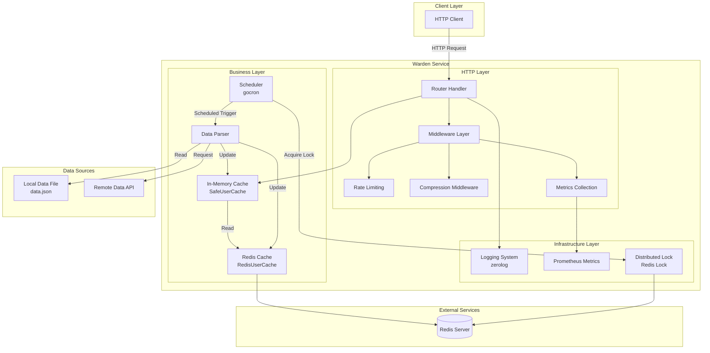
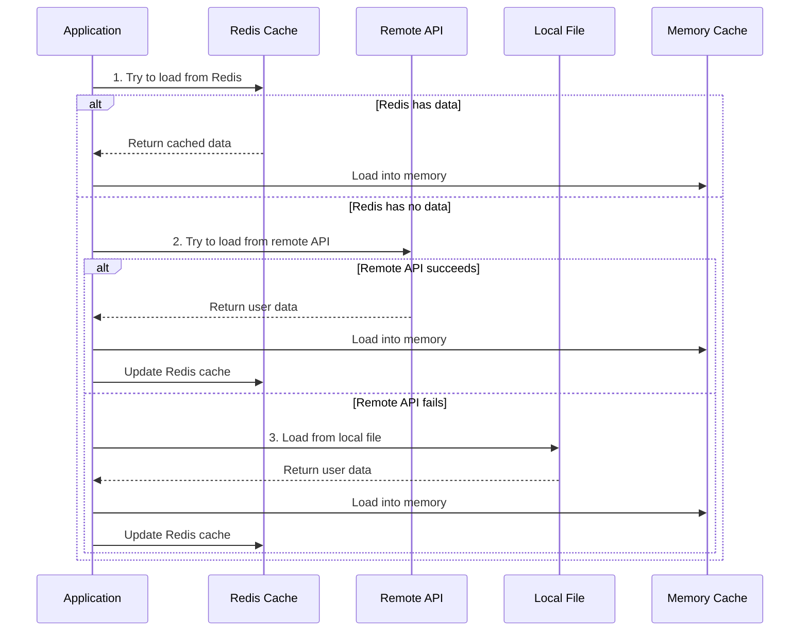
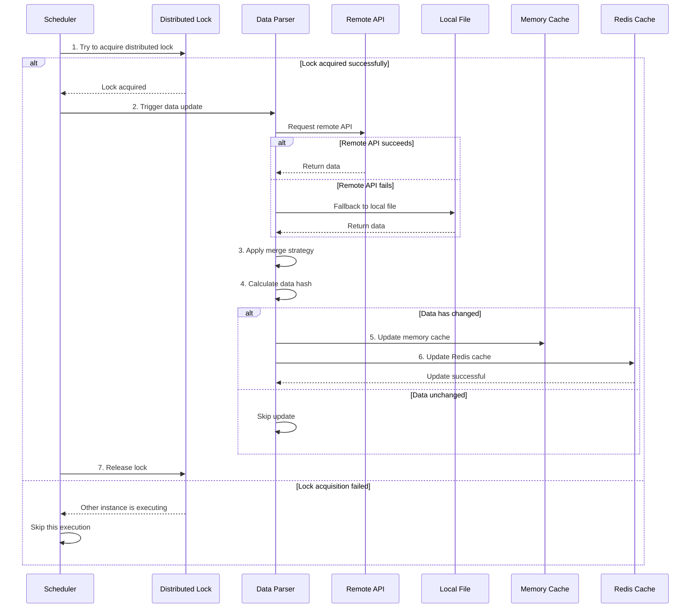
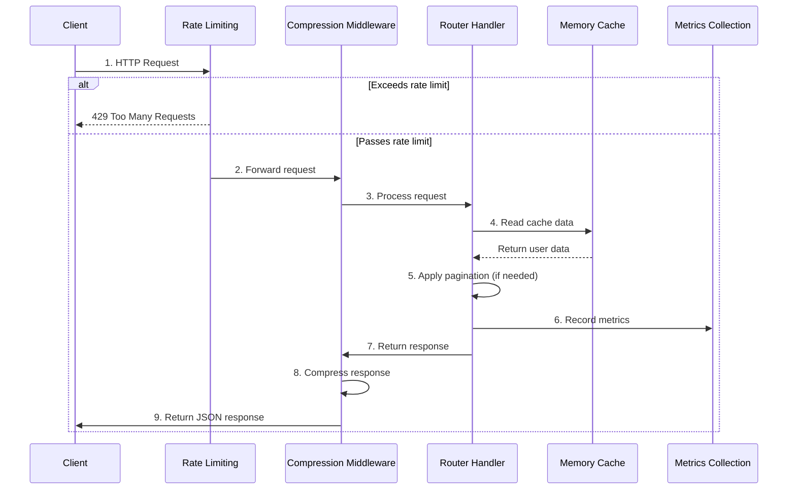

# Warden

> 🌐 **Language / 语言**: [English](README.en.md) | [中文](README.md)

A high-performance AllowList user data service that supports data synchronization and merging from local and remote configuration sources.


> **Warden** (The Gatekeeper) — The guardian of the Stargate who decides who may pass and who will be denied. Just as the Warden of Stargate guards the Stargate, Warden guards your allowlist, ensuring only authorized users can pass through.

## 📋 Project Overview

Warden is a lightweight HTTP API service developed in Go, primarily used for providing and managing allowlist user data (phone numbers and email addresses). The service supports fetching data from local configuration files and remote APIs, and provides multiple data merging strategies to ensure data real-time performance and reliability.

## ✨ Core Features

- 🚀 **High Performance**: Supports 5000+ requests per second with an average latency of 21ms
- 🔄 **Multiple Data Sources**: Supports both local configuration files and remote APIs
- 🎯 **Flexible Strategies**: Provides 6 data merging modes (remote-first, local-first, remote-only, local-only, etc.)
- ⏰ **Scheduled Updates**: Scheduled tasks based on Redis distributed locks for automatic data synchronization
- 📦 **Containerized Deployment**: Complete Docker support, ready to use out of the box
- 📊 **Structured Logging**: Uses zerolog to provide detailed access logs and error logs
- 🔒 **Distributed Locks**: Uses Redis to ensure scheduled tasks don't execute repeatedly in distributed environments

## 🏗️ Architecture Design

### System Architecture Diagram



### Core Components

1. **HTTP Server**: Provides JSON API endpoints to return user lists
   - Supports pagination queries
   - Compresses response data
   - Rate limiting protection
   - Request metrics collection

2. **Data Parser**: Supports parsing user data from local files and remote APIs
   - Local file parsing (JSON format)
   - Remote API calls (with authentication support)
   - Multiple data merging strategies

3. **Scheduler**: Uses gocron to periodically update user data
   - Configurable update intervals
   - Redis-based distributed locks
   - Prevents duplicate execution

4. **Cache System**: Multi-level cache architecture
   - In-memory cache (SafeUserCache): Fast response
   - Redis cache (RedisUserCache): Persistent storage
   - Smart cache update strategy

5. **Logging System**: Structured logging based on zerolog
   - Structured log output
   - Dynamically adjustable log levels
   - Access logs and error logs

6. **Monitoring System**: Prometheus metrics collection
   - HTTP request metrics
   - Cache hit rate
   - Background task execution status

### Data Flow

#### Startup Data Loading Flow



#### Scheduled Task Update Flow



#### Request Processing Flow



### Data Merging Strategies

The system supports 6 data merging modes, selected via the `MODE` parameter:

| Mode | Description | Use Case |
|------|-------------|----------|
| `DEFAULT` / `REMOTE_FIRST` | Remote-first, use local data to supplement when remote data doesn't exist | Default mode, suitable for most scenarios |
| `ONLY_REMOTE` | Use only remote data source | Fully dependent on remote configuration |
| `ONLY_LOCAL` | Use only local configuration file | Offline environment or test environment |
| `LOCAL_FIRST` | Local-first, use remote data to supplement when local data doesn't exist | Local configuration as primary, remote as secondary |
| `REMOTE_FIRST_ALLOW_REMOTE_FAILED` | Remote-first, allow fallback to local when remote fails | High availability scenarios |
| `LOCAL_FIRST_ALLOW_REMOTE_FAILED` | Local-first, allow fallback to remote when local fails | Hybrid mode |

## 📦 Installation and Running

> 💡 **Quick Start**: Want to quickly experience Warden? Check out our [Quick Start Examples](example/README.en.md) / [快速开始示例](example/README.md):
> - [Simple Example](example/basic/README.en.md) / [简单示例](example/basic/README.md) - Basic usage, local data file only
> - [Advanced Example](example/advanced/README.en.md) / [复杂示例](example/advanced/README.md) - Full features, including remote API and Mock service

### Prerequisites

- Go 1.25+ (refer to [go.mod](go.mod))
- Redis (for distributed locks and caching)
- Docker (optional, for containerized deployment)

### Local Running

1. **Clone the project**
```bash
git clone <repository-url>
cd warden
```

2. **Install dependencies**
```bash
go mod download
```

3. **Configure local data file**
Create a `data.json` file (refer to `data.example.json`):
```json
[
    {
        "phone": "13800138000",
        "mail": "admin@admin.com"
    }
]
```

4. **Run the service**
```bash
go run main.go
```

### Using Command Line Arguments

```bash
go run main.go \
  --port 8081 \                    # Web service port (default: 8081)
  --redis localhost:6379 \         # Redis address (default: localhost:6379)
  --redis-password "password" \    # Redis password (optional, recommend using environment variables)
  --config http://example.com/api \ # Remote configuration URL
  --key "Bearer token" \           # Remote configuration authentication header
  --interval 5 \                   # Scheduled task interval (seconds, default: 5)
  --mode DEFAULT \                 # Running mode (see description below)
  --http-timeout 5 \               # HTTP request timeout (seconds, default: 5)
  --http-max-idle-conns 100 \     # HTTP maximum idle connections (default: 100)
  --http-insecure-tls \           # Skip TLS certificate verification (development only)
  --config-file config.yaml        # Configuration file path (supports YAML format)
```

**Notes**:
- Configuration file support: You can use the `--config-file` parameter to specify a YAML format configuration file, see [Configuration File Format](#configuration-file-format) for details
- Redis password security: Recommend using environment variables `REDIS_PASSWORD` or `REDIS_PASSWORD_FILE` instead of command line arguments
- TLS certificate verification: `--http-insecure-tls` is for development environments only, should not be used in production

### Using Environment Variables

Supports configuration via environment variables, with lower priority than command line arguments:

```bash
export PORT=8081
export REDIS=localhost:6379
export REDIS_PASSWORD="password"        # Redis password (optional)
export REDIS_PASSWORD_FILE="/path/to/password/file"  # Redis password file path (optional, higher priority than REDIS_PASSWORD)
export CONFIG=http://example.com/api
export KEY="Bearer token"
export INTERVAL=5
export MODE=DEFAULT
export HTTP_TIMEOUT=5                  # HTTP request timeout (seconds)
export HTTP_MAX_IDLE_CONNS=100         # HTTP maximum idle connections
export HTTP_INSECURE_TLS=false         # Whether to skip TLS certificate verification (true/false or 1/0)
export API_KEY="your-secret-api-key"   # API Key for authentication (strongly recommended)
export TRUSTED_PROXY_IPS="10.0.0.1,172.16.0.1"  # Trusted proxy IP list (comma-separated)
export HEALTH_CHECK_IP_WHITELIST="127.0.0.1,10.0.0.0/8"  # Health check endpoint IP whitelist (optional)
export IP_WHITELIST="192.168.1.0/24"  # Global IP whitelist (optional)
export LOG_LEVEL="info"                # Log level (optional, default: info, options: trace, debug, info, warn, error, fatal, panic)
```

**Environment Variable Priority**:
- Redis password: `REDIS_PASSWORD_FILE` > `REDIS_PASSWORD` > command line argument `--redis-password`

**Security Configuration Notes**:
- `API_KEY`: Used to protect sensitive endpoints (`/`, `/log/level`), strongly recommended for production environments
- `TRUSTED_PROXY_IPS`: Configure trusted reverse proxy IPs to correctly obtain client real IP
- `HEALTH_CHECK_IP_WHITELIST`: Restrict health check endpoint access IPs (optional, supports CIDR ranges)
- `IP_WHITELIST`: Global IP whitelist (optional, supports CIDR ranges)

## ⚙️ Configuration

### Running Mode (MODE)

| Mode | Description |
|------|-------------|
| `DEFAULT` or `REMOTE_FIRST` | Remote-first, use local data to supplement when remote data doesn't exist |
| `ONLY_REMOTE` | Use only remote data source |
| `ONLY_LOCAL` | Use only local configuration file |
| `LOCAL_FIRST` | Local-first, use remote data to supplement when local data doesn't exist |
| `REMOTE_FIRST_ALLOW_REMOTE_FAILED` | Remote-first, allow fallback to local when remote fails |
| `LOCAL_FIRST_ALLOW_REMOTE_FAILED` | Local-first, allow fallback to remote when local fails |

### Configuration File Format

#### Local User Data File (`data.json`)

Local user data file `data.json` format (refer to `data.example.json`):

```json
[
    {
        "phone": "13800138000",
        "mail": "admin@example.com"
    },
    {
        "phone": "13900139000",
        "mail": "user@example.com"
    }
]
```

#### Application Configuration File (`config.yaml`)

Supports YAML format configuration files, specified via the `--config-file` parameter:

```yaml
server:
  port: "8081"
  read_timeout: 5s
  write_timeout: 5s
  shutdown_timeout: 5s
  max_header_bytes: 1048576  # 1MB
  idle_timeout: 120s

redis:
  addr: "localhost:6379"
  password: ""  # Recommend using environment variable REDIS_PASSWORD or REDIS_PASSWORD_FILE
  password_file: ""  # Password file path (higher priority than password)
  db: 0

cache:
  ttl: 3600s
  update_interval: 5s

rate_limit:
  rate: 60  # Requests per minute
  window: 1m

http:
  timeout: 5s
  max_idle_conns: 100
  insecure_tls: false  # Development only
  max_retries: 3
  retry_delay: 1s

remote:
  url: "http://localhost:8080/data.json"
  key: ""
  mode: "DEFAULT"

task:
  interval: 5s

app:
  mode: "DEFAULT"  # Options: DEFAULT, production, prod
```

**Configuration Priority**: Command line arguments > Environment variables > Configuration file > Default values

Refer to example file: [config.example.yaml](config.example.yaml)

### Remote Configuration API Requirements

The remote configuration API should return a JSON array in the same format, with optional Authorization header authentication support.

## 📡 API Documentation

### OpenAPI Documentation

The project provides complete OpenAPI 3.0 specification documentation in the `openapi.yaml` file.

You can use the following tools to view and test the API:

1. **Swagger UI**: Open the `openapi.yaml` file using [Swagger Editor](https://editor.swagger.io/)
2. **Postman**: Import the `openapi.yaml` file into Postman
3. **Redoc**: Use Redoc to generate a beautiful API documentation page

### Quick Reference

#### Get User List

**Request**
```http
GET /
X-API-Key: your-secret-api-key

GET /?page=1&page_size=100
X-API-Key: your-secret-api-key
```

**Note**: This endpoint requires API Key authentication, provided via the `X-API-Key` header or `Authorization: Bearer <key>`.

**Response (no pagination)**
```json
[
    {
        "phone": "13800138000",
        "mail": "admin@example.com"
    },
    {
        "phone": "13900139000",
        "mail": "user@example.com"
    }
]
```

**Response (with pagination)**
```json
{
    "data": [
        {
            "phone": "13800138000",
            "mail": "admin@example.com"
        }
    ],
    "pagination": {
        "page": 1,
        "page_size": 100,
        "total": 200,
        "total_pages": 2
    }
}
```

**Status Code**: `200 OK`

**Content-Type**: `application/json`

#### Health Check

**Request**
```http
GET /health
GET /healthcheck
```

**Response**
```json
{
    "status": "ok",
    "details": {
        "redis": "ok",
        "data_loaded": true,
        "user_count": 100
    },
    "mode": "DEFAULT"
}
```

#### Log Level Management

**Get Current Log Level**
```http
GET /log/level
X-API-Key: your-secret-api-key
```

**Set Log Level**
```http
POST /log/level
Content-Type: application/json
X-API-Key: your-secret-api-key

{
    "level": "debug"
}
```

**Note**: This endpoint requires API Key authentication. All log level modification operations are recorded in security audit logs.

Supported log levels: `trace`, `debug`, `info`, `warn`, `error`, `fatal`, `panic`

#### Prometheus Metrics

**Request**
```http
GET /metrics
```

Returns Prometheus format monitoring metrics data.

For detailed API documentation, please refer to the [openapi.yaml](openapi.yaml) file.

## 🐳 Docker Deployment

> 🚀 **Quick Deployment**: Check the [Examples Directory](example/README.en.md) / [示例目录](example/README.md) for complete Docker Compose configuration examples:
> - [Simple Example](example/basic/docker-compose.yml) / [简单示例](example/basic/docker-compose.yml) - Basic Docker Compose configuration
> - [Advanced Example](example/advanced/docker-compose.yml) / [复杂示例](example/advanced/docker-compose.yml) - Complete configuration including Mock API

### Using Docker Compose

1. **Prepare environment variable file**
   
   If a `.env.example` file exists in the project root directory, you can copy it:
   ```bash
   cp .env.example .env
   ```
   
   If the `.env.example` file doesn't exist, you can manually create a `.env` file with the following content:
   ```env
   # Server Configuration
   PORT=8081
   
   # Redis Configuration
   REDIS=warden-redis:6379
   # Redis password (optional, recommend using environment variables instead of config file)
   # REDIS_PASSWORD=your-redis-password
   # Or use password file (more secure)
   # REDIS_PASSWORD_FILE=/path/to/redis-password.txt
   
   # Remote Data API
   CONFIG=http://example.com/api/data.json
   # Remote configuration API authentication key
   KEY=Bearer your-token-here
   
   # Task Configuration
   INTERVAL=5
   
   # Application Mode
   MODE=DEFAULT
   
   # HTTP Client Configuration (optional)
   # HTTP_TIMEOUT=5
   # HTTP_MAX_IDLE_CONNS=100
   # HTTP_INSECURE_TLS=false
   
   # API Key (for API authentication, required in production)
   API_KEY=your-api-key-here
   
   # Health Check IP Whitelist (optional, comma-separated)
   # HEALTH_CHECK_IP_WHITELIST=127.0.0.1,::1,10.0.0.0/8
   
   # Trusted Proxy IP List (optional, comma-separated, for reverse proxy environments)
   # TRUSTED_PROXY_IPS=127.0.0.1,10.0.0.1
   
   # Log Level (optional)
   # LOG_LEVEL=info
   ```
   
   > ⚠️ **Security Note**: The `.env` file contains sensitive information. Do not commit it to version control. The `.env` file is already ignored by `.gitignore`. Please use the above content as a template to create the `.env` file.

2. **Start the service**
```bash
docker-compose up -d
```

### Manual Image Build

```bash
docker build -f docker/Dockerfile -t warden-release .
```

### Run Container

```bash
docker run -d \
  -p 8081:8081 \
  -v $(pwd)/data.json:/app/data.json:ro \
  -e PORT=8081 \
  -e REDIS=localhost:6379 \
  -e CONFIG=http://example.com/api \
  -e KEY="Bearer token" \
  warden-release
```

## 📊 Performance Metrics

Based on wrk stress test results (30-second test, 16 threads, 100 connections):

```
Requests/sec:   5038.81
Transfer/sec:   38.96MB
Average Latency: 21.30ms
Max Latency:     226.09ms
```

## 📁 Project Structure

```
warden/
├── main.go                 # Program entry point
├── data.example.json      # Local data file example
├── go.mod                 # Go module definition
├── docker-compose.yml     # Docker Compose configuration
├── docker/
│   └── Dockerfile         # Docker image build file
├── example/               # Quick start examples
│   ├── README.md          # Example documentation
│   ├── basic/             # Simple example (local file only)
│   └── advanced/          # Advanced example (full features)
├── internal/
│   ├── cache/             # Redis cache and lock implementation
│   ├── cmd/               # Command line argument parsing
│   ├── define/            # Constant definitions and data structures
│   ├── logger/            # Logging initialization
│   ├── parser/            # Data parser (local/remote)
│   ├── router/            # HTTP route handling
│   └── version/           # Version information
└── pkg/
    └── gocron/            # Scheduled task scheduler
```

## 🔒 Security Features

### Implemented Security Features

1. **API Authentication**: Supports API Key authentication to protect sensitive endpoints
2. **SSRF Protection**: Strictly validates remote configuration URLs to prevent Server-Side Request Forgery attacks
3. **Input Validation**: Strictly validates all input parameters to prevent injection attacks
4. **Rate Limiting**: IP-based rate limiting to prevent DDoS attacks
5. **TLS Verification**: Production environments enforce TLS certificate verification
6. **Error Handling**: Production environments hide detailed error information to prevent information leakage
7. **Security Response Headers**: Automatically adds security-related HTTP response headers
8. **IP Whitelist**: Supports configuring IP whitelist for health check endpoints
9. **Configuration File Validation**: Prevents path traversal attacks
10. **JSON Size Limits**: Limits JSON response body size to prevent memory exhaustion attacks

### Security Best Practices

1. **Production Environment Configuration**:
   - Must set `API_KEY` environment variable
   - Set `MODE=production` to enable production mode
   - Configure `TRUSTED_PROXY_IPS` to correctly obtain client IP
   - Use `HEALTH_CHECK_IP_WHITELIST` to restrict health check access

2. **Sensitive Information Management**:
   - Do not store sensitive information (API Keys, passwords, etc.) in configuration files
   - Use environment variables or password files to store sensitive information
   - Ensure configuration file permissions are set correctly

3. **Network Security**:
   - Production environments must use HTTPS
   - Configure firewall rules to restrict access
   - Regularly update dependencies to fix known vulnerabilities

4. **Monitoring and Auditing**:
   - Monitor security event logs
   - Regularly review access logs
   - Use security scanning tools in CI/CD

For detailed security audit reports, please refer to [SECURITY_AUDIT.md](SECURITY_AUDIT.md)

## 🔧 Development Guide

> 📚 **Reference Examples**: Check the [Examples Directory](example/README.en.md) / [示例目录](example/README.md) for complete example code and configurations for different usage scenarios.

### Adding New Features

1. Core business logic is in the `internal/` directory
2. Route handling is in the `internal/router/` directory
3. Data parsing logic is in the `internal/parser/` directory

### Testing

```bash
# Run all tests
go test ./...

# Run tests and view coverage
go test -cover ./...

# Generate coverage report
go test -coverprofile=coverage.out ./...
go tool cover -html=coverage.out
```

### Code Standards

The project follows Go official code standards and best practices. For detailed standards, please refer to:

- [CODE_STYLE.en.md](CODE_STYLE.en.md) / [CODE_STYLE.md](CODE_STYLE.md) - Code style guide
- [CONTRIBUTING.en.md](CONTRIBUTING.en.md) / [CONTRIBUTING.md](CONTRIBUTING.md) - Contribution guide

### API Documentation

The project provides complete OpenAPI 3.0 specification documentation:

- [openapi.yaml](openapi.yaml) - OpenAPI specification file

You can use the following tools to view:

- [Swagger Editor](https://editor.swagger.io/) - Online viewing and editing
- [Redoc](https://github.com/Redocly/redoc) - Generate beautiful documentation pages
- Postman - Import and test APIs

## 📝 Logging

The service uses structured logging to record the following information:

- **Access Logs**: HTTP request method, URL, status code, response size, duration
- **Business Logs**: Data updates, rule loading, error information
- **System Logs**: Service startup, shutdown, version information

## 🔒 Security Recommendations

1. Production environments should use HTTPS
2. Remote configuration APIs should use authentication mechanisms (Authorization header)
3. Redis should be configured with password protection
4. Regularly update dependency packages to fix security vulnerabilities

## 📄 License

See the [LICENSE](LICENSE) file for details.

## 🤝 Contributing

Welcome to submit Issues and Pull Requests!

## 📞 Contact

For questions or suggestions, please contact via Issues.

---

**Version**: See `RELEASE_VERSION` file  
**Build Information**: The program displays version, build time, and code version on startup

