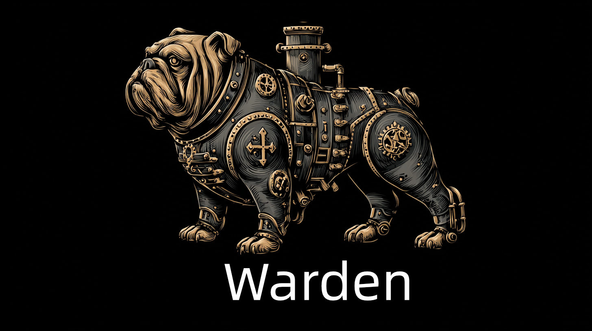

# Warden

[](LICENSE)
[](https://golang.org)
[](https://codecov.io/gh/soulteary/warden)
[](.github/goreportcard-report.md)

> 🌐 **Language / 语言**: [English](README.md) | [中文](README.zhCN.md) | [Français](README.frFR.md) | [Italiano](README.itIT.md) | [日本語](README.jaJP.md) | [Deutsch](README.deDE.md) | [한국어](README.koKR.md)

Un servizio dati utente ad alta prestazione per liste di autorizzazione (AllowList) che supporta la sincronizzazione e la fusione di dati da fonti di configurazione locali e remote.



> **Warden** (Il Guardiano) — Il guardiano della Porta Stellare che decide chi può passare e chi sarà rifiutato. Proprio come il Guardiano di Stargate protegge la Porta Stellare, Warden protegge la tua lista di autorizzazione, garantendo che solo gli utenti autorizzati possano passare.

## 📋 Panoramica

Warden è un servizio API HTTP leggero sviluppato in Go, utilizzato principalmente per fornire e gestire dati utente di liste di autorizzazione (numeri di telefono e indirizzi email). Il servizio supporta il recupero di dati da file di configurazione locali e API remote, e fornisce multiple strategie di fusione dati per garantire prestazioni e affidabilità dei dati in tempo reale.

Warden può essere utilizzato **in modo autonomo** o integrato con altri servizi (come Stargate e Herald) come parte di un'architettura di autenticazione più ampia. Per informazioni dettagliate sull'architettura, vedere la [Documentazione dell'Architettura](docs/enUS/ARCHITECTURE.md).

## ✨ Caratteristiche Principali

- 🚀 **Alte Prestazioni**: Oltre 5000 richieste al secondo con una latenza media di 21ms
- 🔄 **Fonti Dati Multiple**: File di configurazione locali e API remote
- 🎯 **Strategie Flessibili**: 6 modalità di fusione dati (priorità remota, priorità locale, solo remoto, solo locale, ecc.)
- ⏰ **Aggiornamenti Programmati**: Sincronizzazione automatica dei dati con blocchi distribuiti Redis
- 📦 **Distribuzione Containerizzata**: Supporto Docker completo, pronto all'uso
- 🌐 **Supporto Multi-lingua**: 7 lingue con rilevamento automatico della lingua

## 🚀 Guida Rapida

### Opzione 1: Docker (Consigliato)

Il modo più veloce per iniziare è utilizzare l'immagine Docker pre-costruita:

```bash
# Scaricare l'immagine più recente
docker pull ghcr.io/soulteary/warden:latest

# Creare un file di dati
cat > data.json <<EOF
[
    {
        "phone": "13800138000",
        "mail": "admin@example.com"
    }
]
EOF

# Eseguire il contenitore
docker run -d \
  -p 8081:8081 \
  -v $(pwd)/data.json:/app/data.json:ro \
  -e API_KEY=your-api-key-here \
  ghcr.io/soulteary/warden:latest
```

> 💡 **Suggerimento**: Per esempi completi con Docker Compose, vedere la [Directory degli Esempi](example/README.md).

### Opzione 2: Dal Codice Sorgente

1. **Clonare e costruire**
```bash
git clone <repository-url>
cd warden
go mod download
```

2. **Creare un file di dati**
Crea un file `data.json` (fare riferimento a `data.example.json`):
```json
[
    {
        "phone": "13800138000",
        "mail": "admin@example.com"
    }
]
```

3. **Eseguire il servizio**
```bash
go run . --api-key your-api-key-here
```

## ⚙️ Configurazione Essenziale

Warden supporta la configurazione tramite argomenti da riga di comando, variabili d'ambiente e file di configurazione. Di seguito sono riportate le impostazioni più essenziali:

| Impostazione | Variabile d'Ambiente | Descrizione | Richiesto |
|--------------|---------------------|-------------|-----------|
| Porta | `PORT` | Porta del server HTTP (predefinito: 8081) | No |
| Chiave API | `API_KEY` | Chiave di autenticazione API (consigliata per la produzione) | Consigliato |
| Redis | `REDIS` | Indirizzo Redis per la cache e i blocchi distribuiti (es: `localhost:6379`) | Opzionale |
| File Dati | - | Percorso del file dati locale (predefinito: `data.json`) | Sì* |
| Configurazione Remota | `CONFIG` | URL dell'API remota per il recupero dei dati | Opzionale |

\* Richiesto se non si utilizza un'API remota

Per le opzioni di configurazione complete, vedere la [Documentazione di Configurazione](docs/enUS/CONFIGURATION.md).

## 📡 Utilizzo API

Warden fornisce un'API RESTful per interrogare elenchi di utenti, paginazione e controlli di salute. Il servizio supporta risposte multi-lingua tramite il parametro di query `?lang=xx` o l'intestazione `Accept-Language`.

**Esempio**:
```bash
# Interrogare gli utenti
curl -H "X-API-Key: your-key" "http://localhost:8081/"

# Controllo di salute
curl "http://localhost:8081/health"
```

Per la documentazione API completa, vedere la [Documentazione API](docs/enUS/API.md) o la [Specifica OpenAPI](openapi.yaml).

## 📊 Prestazioni

Basato sul test di carico wrk (30s, 16 thread, 100 connessioni):
- **Richieste/sec**: 5038.81
- **Latenza Media**: 21.30ms
- **Latenza Massima**: 226.09ms

## 📚 Documentazione

### Documentazione Principale

- **[Architettura](docs/enUS/ARCHITECTURE.md)** - Architettura tecnica e decisioni di progettazione
- **[Riferimento API](docs/enUS/API.md)** - Documentazione completa degli endpoint API
- **[Configurazione](docs/enUS/CONFIGURATION.md)** - Riferimento e esempi di configurazione
- **[Distribuzione](docs/enUS/DEPLOYMENT.md)** - Guida alla distribuzione (Docker, Kubernetes, ecc.)

### Risorse Aggiuntive

- **[Guida allo Sviluppo](docs/enUS/DEVELOPMENT.md)** - Configurazione dell'ambiente di sviluppo e guida al contributo
- **[Sicurezza](docs/enUS/SECURITY.md)** - Funzionalità di sicurezza e best practice
- **[SDK](docs/enUS/SDK.md)** - Documentazione d'uso del SDK Go
- **Guide di migrazione** - [Configurazione](docs/migration-config.md), [HMAC v2](docs/migration-hmac-v2.md) e [crittografia remota v2](docs/migration-encryption-v2.md)
- **[Esempi](example/README.md)** - Esempi di guida rapida (base e avanzati)

## 📄 Licenza

Vedere il file [LICENSE](LICENSE) per i dettagli.

## 🤝 Contribuire

Le segnalazioni di Issues e Pull Requests sono benvenute! Vedere [CONTRIBUTING.md](docs/enUS/CONTRIBUTING.md) per le linee guida.
