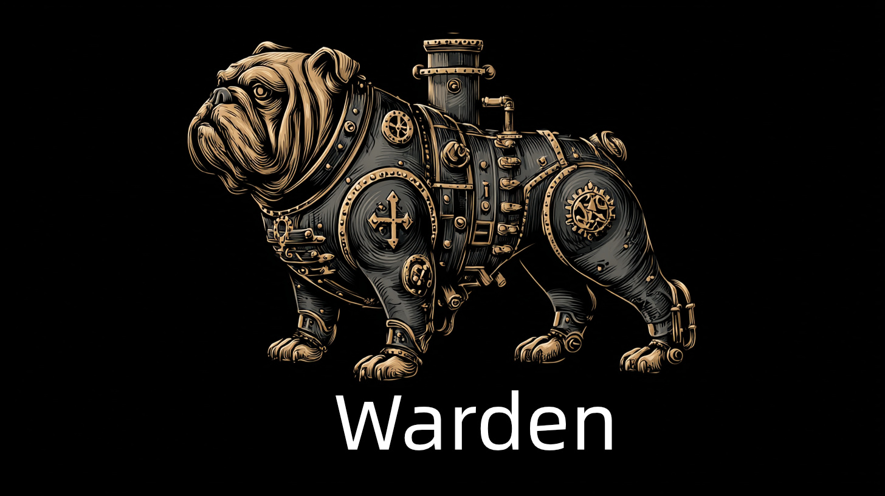

# Warden

> 🌐 **Language / 语言**: [English](README.md) | [中文](README.zhCN.md) | [Français](README.frFR.md) | [Italiano](README.itIT.md) | [日本語](README.jaJP.md) | [Deutsch](README.deDE.md) | [한국어](README.koKR.md)

로컬 및 원격 구성 소스에서 데이터 동기화 및 병합을 지원하는 고성능 허용 목록(AllowList) 사용자 데이터 서비스입니다.



> **Warden**（看守者）—— 스타게이트의 수호자로서 누가 통과할 수 있고 누가 거부될지 결정합니다. 스타게이트의 수호자가 스타게이트를 지키는 것처럼, Warden은 허용 목록을 지키며 승인된 사용자만 통과할 수 있도록 합니다.

## 📋 프로젝트 개요

Warden은 Go로 개발된 경량 HTTP API 서비스로, 주로 허용 목록 사용자 데이터(전화번호 및 이메일 주소)를 제공하고 관리하는 데 사용됩니다. 이 서비스는 로컬 구성 파일과 원격 API에서 데이터를 가져오는 것을 지원하며, 실시간 성능과 신뢰성을 보장하기 위한 여러 데이터 병합 전략을 제공합니다.

## ✨ 핵심 기능

- 🚀 **고성능**: 평균 지연 시간 21ms로 초당 5000개 이상의 요청 지원
- 🔄 **다중 데이터 소스**: 로컬 구성 파일과 원격 API 모두 지원
- 🎯 **유연한 전략**: 6가지 데이터 병합 모드 제공(원격 우선, 로컬 우선, 원격 전용, 로컬 전용 등)
- ⏰ **예약 업데이트**: Redis 분산 잠금 기반 예약 작업으로 자동 데이터 동기화
- 📦 **컨테이너화 배포**: 완전한 Docker 지원, 즉시 사용 가능
- 📊 **구조화된 로깅**: zerolog를 사용하여 상세한 액세스 로그 및 오류 로그 제공
- 🔒 **분산 잠금**: Redis를 사용하여 분산 환경에서 예약 작업이 반복 실행되지 않도록 보장
- 🌐 **다국어 지원**: 7개 언어(영어, 중국어, 프랑스어, 이탈리아어, 일본어, 독일어, 한국어) 지원 및 사용자 언어 설정 자동 감지

## 🏗️ 아키텍처 설계

Warden은 HTTP 계층, 비즈니스 계층 및 인프라 계층을 포함하는 계층형 아키텍처 설계를 사용합니다. 시스템은 다중 데이터 소스, 다단계 캐싱 및 분산 잠금 메커니즘을 지원합니다.

자세한 아키텍처 문서는 다음을 참조하세요: [아키텍처 설계 문서](docs/enUS/ARCHITECTURE.md)

## 📦 설치 및 실행

> 💡 **빠른 시작**: Warden을 빠르게 체험하고 싶으신가요? [빠른 시작 예제](example/README.en.md)를 확인하세요:
> - [간단한 예제](example/basic/README.en.md) - 기본 사용, 로컬 데이터 파일만
> - [고급 예제](example/advanced/README.en.md) - 원격 API 및 Mock 서비스를 포함한 전체 기능

### 사전 요구사항

- Go 1.25+ ([go.mod](go.mod) 참조)
- Redis (분산 잠금 및 캐싱용)
- Docker (선택사항, 컨테이너화 배포용)

### 빠른 시작

1. **프로젝트 클론**
```bash
git clone <repository-url>
cd warden
```

2. **의존성 설치**
```bash
go mod download
```

3. **로컬 데이터 파일 구성**
`data.json` 파일 생성(`data.example.json` 참조):
```json
[
    {
        "phone": "13800138000",
        "mail": "admin@example.com"
    }
]
```

4. **서비스 실행**
```bash
go run main.go
```

자세한 구성 및 배포 지침은 다음을 참조하세요:
- [구성 문서](docs/enUS/CONFIGURATION.md) - 모든 구성 옵션 알아보기
- [배포 문서](docs/enUS/DEPLOYMENT.md) - 배포 방법 알아보기

## ⚙️ 구성

Warden은 명령줄 인수, 환경 변수 및 구성 파일 등 여러 구성 방법을 지원합니다. 시스템은 유연한 구성 전략을 가진 6가지 데이터 병합 모드를 제공합니다.

자세한 구성 문서는 다음을 참조하세요: [구성 문서](docs/enUS/CONFIGURATION.md)

## 📡 API 문서

Warden은 사용자 목록 쿼리, 페이지네이션, 상태 확인 등을 지원하는 완전한 RESTful API를 제공합니다. 프로젝트는 OpenAPI 3.0 사양 문서도 제공합니다.

자세한 API 문서는 다음을 참조하세요: [API 문서](docs/enUS/API.md)

OpenAPI 사양 파일: [openapi.yaml](openapi.yaml)

## 🌐 다국어 지원

Warden은 완전한 국제화(i18N) 기능을 지원합니다. 모든 API 응답, 오류 메시지 및 로그가 국제화를 지원합니다.

### 지원 언어

- 🇺🇸 영어 (en) - 기본값
- 🇨🇳 중국어 (zh)
- 🇫🇷 프랑스어 (fr)
- 🇮🇹 이탈리아어 (it)
- 🇯🇵 일본어 (ja)
- 🇩🇪 독일어 (de)
- 🇰🇷 한국어 (ko)

### 언어 감지

Warden은 다음 우선순위로 두 가지 언어 감지 방법을 지원합니다:

1. **쿼리 매개변수**: `?lang=ko`로 언어 지정
2. **Accept-Language 헤더**: 브라우저 언어 설정 자동 감지
3. **기본 언어**: 지정되지 않은 경우 영어 사용

### 사용 예제

```bash
# 쿼리 매개변수로 한국어 지정
curl -H "X-API-Key: your-key" "http://localhost:8081/?lang=ko"

# Accept-Language 헤더로 자동 감지
curl -H "X-API-Key: your-key" -H "Accept-Language: ko-KR,ko;q=0.9" "http://localhost:8081/"

# 일본어 사용
curl -H "X-API-Key: your-key" "http://localhost:8081/?lang=ja"
```

## 🔌 SDK 사용

Warden은 다른 프로젝트에서 통합을 용이하게 하는 Go SDK를 제공합니다. SDK는 캐싱, 인증 등의 기능을 지원하는 간단한 API 인터페이스를 제공합니다.

자세한 SDK 문서는 다음을 참조하세요: [SDK 문서](docs/enUS/SDK.md)

## 🐳 Docker 배포

Warden은 완전한 Docker 및 Docker Compose 배포를 지원하며 즉시 사용할 수 있습니다.

### 사전 빌드된 이미지로 빠른 시작(권장)

GitHub Container Registry(GHCR)에서 제공하는 사전 빌드된 이미지를 사용하여 로컬 빌드 없이 빠르게 시작:

```bash
# 최신 버전 이미지 가져오기
docker pull ghcr.io/soulteary/warden:latest

# 컨테이너 실행(기본 예제)
docker run -d \
  -p 8081:8081 \
  -v $(pwd)/data.json:/app/data.json:ro \
  -e PORT=8081 \
  -e REDIS=localhost:6379 \
  -e API_KEY=your-api-key-here \
  ghcr.io/soulteary/warden:latest
```

> 💡 **팁**: 사전 빌드된 이미지를 사용하면 로컬 빌드 환경 없이 빠르게 시작할 수 있습니다. 이미지는 자동으로 업데이트되어 최신 버전을 사용하고 있는지 확인합니다.

### Docker Compose 사용

> 🚀 **빠른 배포**: 전체 Docker Compose 구성 예제는 [예제 디렉토리](example/README.en.md)를 확인하세요

자세한 배포 문서는 다음을 참조하세요: [배포 문서](docs/enUS/DEPLOYMENT.md)

## 📊 성능 지표

wrk 부하 테스트 결과 기반(30초 테스트, 16 스레드, 100 연결):

```
Requests/sec:   5038.81
Transfer/sec:   38.96MB
평균 지연 시간: 21.30ms
최대 지연 시간: 226.09ms
```

## 📁 프로젝트 구조

```
warden/
├── main.go                 # 프로그램 진입점
├── data.example.json      # 로컬 데이터 파일 예제
├── config.example.yaml    # 구성 파일 예제
├── openapi.yaml           # OpenAPI 사양 파일
├── go.mod                 # Go 모듈 정의
├── docker-compose.yml     # Docker Compose 구성
├── LICENSE                # 라이선스 파일
├── README.*.md            # 다국어 프로젝트 문서(중국어/영어/프랑스어/이탈리아어/일본어/독일어/한국어)
├── CONTRIBUTING.*.md      # 다국어 기여 가이드
├── docker/
│   └── Dockerfile         # Docker 이미지 빌드 파일
├── docs/                  # 문서 디렉토리(다국어)
│   ├── enUS/              # 영어 문서
│   └── zhCN/              # 중국어 문서
├── example/               # 빠른 시작 예제
│   ├── basic/             # 간단한 예제(로컬 파일만)
│   └── advanced/          # 고급 예제(전체 기능, Mock API 포함)
├── internal/
│   ├── cache/             # Redis 캐시 및 잠금 구현
│   ├── cmd/               # 명령줄 인수 구문 분석
│   ├── config/            # 구성 관리
│   ├── define/            # 상수 정의 및 데이터 구조
│   ├── di/                # 종속성 주입
│   ├── errors/            # 오류 처리
│   ├── i18n/              # 국제화 지원
│   ├── logger/            # 로깅 초기화
│   ├── metrics/           # 메트릭 수집
│   ├── middleware/        # HTTP 미들웨어
│   ├── parser/            # 데이터 파서(로컬/원격)
│   ├── router/            # HTTP 라우팅 처리
│   ├── validator/         # 검증기
│   └── version/           # 버전 정보
├── pkg/
│   ├── gocron/            # 예약 작업 스케줄러
│   └── warden/            # Warden SDK
├── scripts/               # 스크립트 디렉토리
└── .github/               # GitHub 구성(CI/CD, Issue/PR 템플릿 등)
```

## 🔒 보안 기능

Warden은 API 인증, SSRF 보호, 속도 제한, TLS 검증 등 여러 보안 기능을 구현합니다.

자세한 보안 문서는 다음을 참조하세요: [보안 문서](docs/enUS/SECURITY.md)

## 🔧 개발 가이드

> 📚 **참조 예제**: 다양한 사용 시나리오에 대한 전체 예제 코드 및 구성을 보려면 [예제 디렉토리](example/README.en.md)를 확인하세요.

자세한 개발 문서는 다음을 참조하세요: [개발 문서](docs/enUS/DEVELOPMENT.md)

### 코드 표준

프로젝트는 Go 공식 코드 표준 및 모범 사례를 따릅니다. 자세한 표준은 다음을 참조하세요:

- [CODE_STYLE.md](docs/enUS/CODE_STYLE.md) - 코드 스타일 가이드
- [CONTRIBUTING.en.md](CONTRIBUTING.en.md) - 기여 가이드

## 📄 라이선스

자세한 내용은 [LICENSE](LICENSE) 파일을 참조하세요.

## 🤝 기여

Issues 및 Pull Request 제출을 환영합니다!

## 📞 연락처

질문이나 제안사항이 있으시면 Issues를 통해 연락해 주세요.

---

**버전**: 프로그램은 시작 시 버전, 빌드 시간 및 코드 버전을 표시합니다(`warden --version` 또는 시작 로그를 통해)
