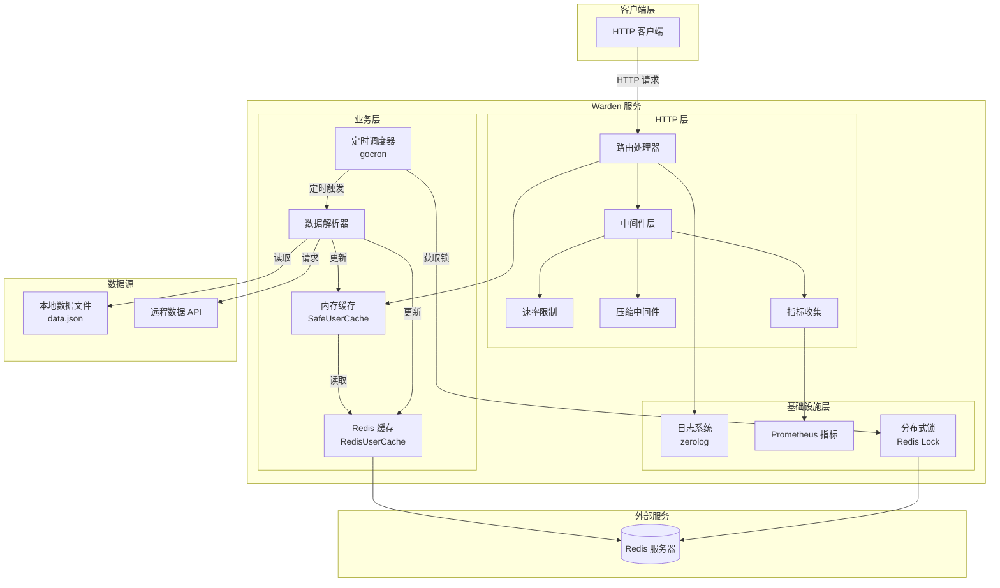
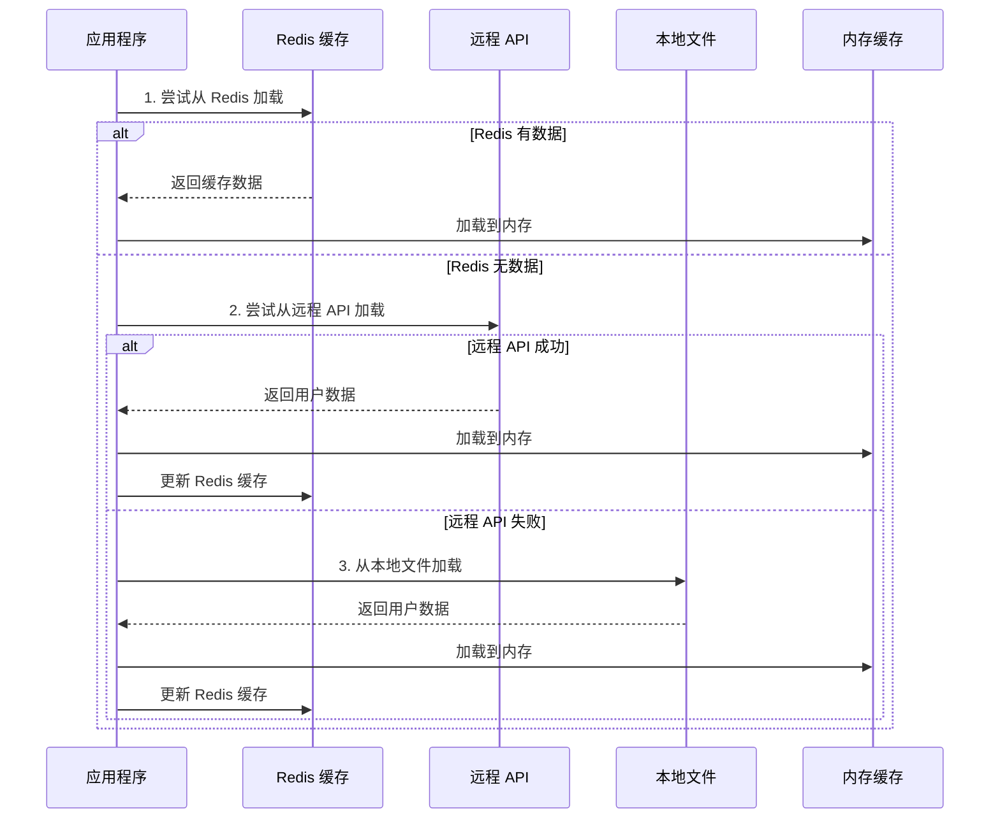
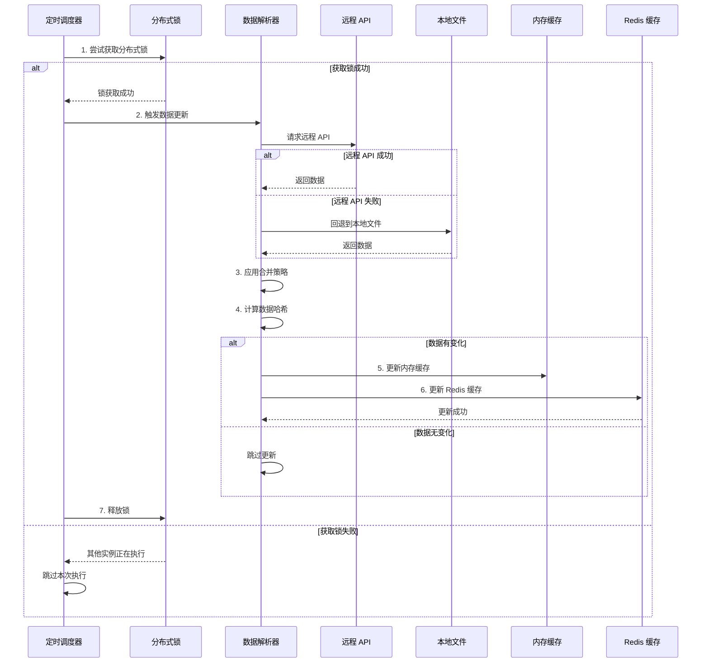
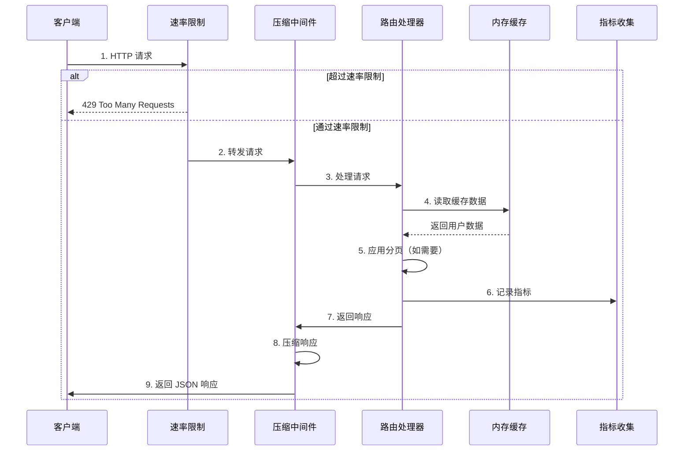

# Warden

> 🌐 **Language / 语言**: [English](README.en.md) | [中文](README.md)


一个高性能的允许列表（AllowList）用户数据服务，支持本地和远程配置源的数据同步与合并。

> **Warden**（看守者）—— 守护星门的看守者，决定谁可以通过，谁将被拒绝。正如 Stargate 的看守者守护着星际之门，Warden 守护着你的允许列表，确保只有授权用户能够通过。

## 📋 项目简介

Warden 是一个基于 Go 语言开发的轻量级 HTTP API 服务，主要用于提供和管理允许列表用户数据（手机号和邮箱）。该服务支持从本地配置文件和远程 API 获取数据，并提供了多种数据合并策略，确保数据的实时性和可靠性。

## ✨ 核心特性

- 🚀 **高性能**: 支持每秒 5000+ 请求，平均延迟 21ms
- 🔄 **多数据源**: 支持本地配置文件和远程 API 两种数据源
- 🎯 **灵活策略**: 提供 6 种数据合并模式（远程优先、本地优先、仅远程、仅本地等）
- ⏰ **定时更新**: 基于 Redis 分布式锁的定时任务，自动同步数据
- 📦 **容器化部署**: 完整的 Docker 支持，开箱即用
- 📊 **结构化日志**: 使用 zerolog 提供详细的访问日志和错误日志
- 🔒 **分布式锁**: 使用 Redis 确保定时任务在分布式环境下不会重复执行

## 🏗️ 架构设计

### 系统架构图



### 核心组件

1. **HTTP 服务器**: 提供 JSON API 接口返回用户列表
   - 支持分页查询
   - 压缩响应数据
   - 速率限制保护
   - 请求指标收集

2. **数据解析器**: 支持从本地文件和远程 API 解析用户数据
   - 本地文件解析（JSON 格式）
   - 远程 API 调用（支持认证）
   - 多种数据合并策略

3. **定时调度器**: 使用 gocron 定期更新用户数据
   - 可配置的更新间隔
   - 基于 Redis 的分布式锁
   - 防止重复执行

4. **缓存系统**: 多级缓存架构
   - 内存缓存（SafeUserCache）：快速响应
   - Redis 缓存（RedisUserCache）：持久化存储
   - 智能缓存更新策略

5. **日志系统**: 基于 zerolog 的结构化日志记录
   - 结构化日志输出
   - 可动态调整日志级别
   - 访问日志和错误日志

6. **监控系统**: Prometheus 指标收集
   - HTTP 请求指标
   - 缓存命中率
   - 后台任务执行情况

### 数据流程

#### 启动时数据加载流程



#### 定时任务更新流程



#### 请求处理流程



### 数据合并策略

系统支持 6 种数据合并模式，根据 `MODE` 参数选择：

| 模式 | 说明 | 使用场景 |
|------|------|----------|
| `DEFAULT` / `REMOTE_FIRST` | 远程优先，远程数据不存在时使用本地数据补充 | 默认模式，适合大多数场景 |
| `ONLY_REMOTE` | 仅使用远程数据源 | 完全依赖远程配置 |
| `ONLY_LOCAL` | 仅使用本地配置文件 | 离线环境或测试环境 |
| `LOCAL_FIRST` | 本地优先，本地数据不存在时使用远程数据补充 | 本地配置为主，远程为辅 |
| `REMOTE_FIRST_ALLOW_REMOTE_FAILED` | 远程优先，允许远程失败时回退到本地 | 高可用场景 |
| `LOCAL_FIRST_ALLOW_REMOTE_FAILED` | 本地优先，允许远程失败时回退到本地 | 混合模式 |

## 📦 安装与运行

> 💡 **快速开始**: 想要快速体验 Warden？查看我们的 [快速开始示例](example/README.md) / [Quick Start Examples](example/README.en.md)：
> - [简单示例](example/basic/README.md) / [Simple Example](example/basic/README.en.md) - 基础使用，仅本地数据文件
> - [复杂示例](example/advanced/README.md) / [Advanced Example](example/advanced/README.en.md) - 完整功能，包含远程 API 和 Mock 服务

### 前置要求

- Go 1.25+ (参考 [go.mod](go.mod))
- Redis (用于分布式锁和缓存)
- Docker (可选，用于容器化部署)

### 本地运行

1. **克隆项目**
```bash
git clone <repository-url>
cd warden
```

2. **安装依赖**
```bash
go mod download
```

3. **配置本地数据文件**
创建 `data.json` 文件（可参考 `data.example.json`）：
```json
[
    {
        "phone": "13800138000",
        "mail": "admin@example.com"
    }
]
```

**注意**：`data.json` 支持以下字段：
- `phone`（必需）：用户手机号
- `mail`（必需）：用户邮箱地址
- `user_id`（可选）：用户唯一标识符，如果未提供则自动生成
- `status`（可选）：用户状态，如 "active"、"inactive"、"suspended"，默认为 "active"
- `scope`（可选）：用户权限范围数组，如 `["read", "write"]`
- `role`（可选）：用户角色，如 "admin"、"user"

完整示例请参考 `data.example.json` 文件。

4. **运行服务**
```bash
go run main.go
```

### 使用命令行参数

```bash
go run main.go \
  --port 8081 \                    # Web 服务端口 (默认: 8081)
  --redis localhost:6379 \         # Redis 地址 (默认: localhost:6379)
  --redis-password "password" \    # Redis 密码（可选，建议使用环境变量）
  --redis-enabled=true \           # 启用/禁用 Redis（默认: true）
  --config http://example.com/api \ # 远程配置 URL
  --key "Bearer token" \           # 远程配置认证头
  --interval 5 \                   # 定时任务间隔（秒，默认: 5）
  --mode DEFAULT \                 # 运行模式（见下方说明）
  --http-timeout 5 \               # HTTP 请求超时时间（秒，默认: 5）
  --http-max-idle-conns 100 \     # HTTP 最大空闲连接数 (默认: 100)
  --http-insecure-tls \           # 跳过 TLS 证书验证（仅用于开发环境）
  --api-key "your-secret-api-key" \ # API Key 用于认证（可选，建议使用环境变量）
  --config-file config.yaml        # 配置文件路径（支持 YAML 格式）
```

**注意**：
- 配置文件支持：可以使用 `--config-file` 参数指定 YAML 格式的配置文件，详见 [配置文件格式](#配置文件格式)
- Redis 密码安全：建议使用环境变量 `REDIS_PASSWORD` 或 `REDIS_PASSWORD_FILE` 而不是命令行参数
- TLS 证书验证：`--http-insecure-tls` 仅用于开发环境，生产环境不应使用

### 使用环境变量

支持通过环境变量配置，优先级低于命令行参数：

```bash
export PORT=8081
export REDIS=localhost:6379
export REDIS_PASSWORD="password"        # Redis 密码（可选）
export REDIS_PASSWORD_FILE="/path/to/password/file"  # Redis 密码文件路径（可选，优先级高于 REDIS_PASSWORD）
export REDIS_ENABLED=true               # 启用/禁用 Redis（可选，默认: true，支持 true/false/1/0）
export CONFIG=http://example.com/api
export KEY="Bearer token"
export INTERVAL=5
export MODE=DEFAULT
export HTTP_TIMEOUT=5                  # HTTP 请求超时时间（秒）
export HTTP_MAX_IDLE_CONNS=100         # HTTP 最大空闲连接数
export HTTP_INSECURE_TLS=false         # 是否跳过 TLS 证书验证（true/false 或 1/0）
export API_KEY="your-secret-api-key"   # API Key 用于认证（强烈建议设置）
export TRUSTED_PROXY_IPS="10.0.0.1,172.16.0.1"  # 信任的代理 IP 列表（逗号分隔）
export HEALTH_CHECK_IP_WHITELIST="127.0.0.1,10.0.0.0/8"  # 健康检查端点 IP 白名单（可选）
export IP_WHITELIST="192.168.1.0/24"  # 全局 IP 白名单（可选）
export LOG_LEVEL="info"                # 日志级别（可选，默认: info，可选值: trace, debug, info, warn, error, fatal, panic）
```

**环境变量优先级**：
- Redis 密码：`REDIS_PASSWORD_FILE` > `REDIS_PASSWORD` > 命令行参数 `--redis-password`

**安全配置说明**：
- `API_KEY`: 用于保护敏感端点（`/`、`/log/level`），强烈建议在生产环境设置
- `TRUSTED_PROXY_IPS`: 配置信任的反向代理 IP，用于正确获取客户端真实 IP
- `HEALTH_CHECK_IP_WHITELIST`: 限制健康检查端点的访问 IP（可选，支持 CIDR 网段）
- `IP_WHITELIST`: 全局 IP 白名单（可选，支持 CIDR 网段）

## ⚙️ 配置说明

### 运行模式 (MODE)

| 模式 | 说明 |
|------|------|
| `DEFAULT` 或 `REMOTE_FIRST` | 远程优先，远程数据不存在时使用本地数据补充 |
| `ONLY_REMOTE` | 仅使用远程数据源 |
| `ONLY_LOCAL` | 仅使用本地配置文件 |
| `LOCAL_FIRST` | 本地优先，本地数据不存在时使用远程数据补充 |
| `REMOTE_FIRST_ALLOW_REMOTE_FAILED` | 远程优先，允许远程失败时回退到本地 |
| `LOCAL_FIRST_ALLOW_REMOTE_FAILED` | 本地优先，允许远程失败时回退到本地 |

### 配置文件格式

#### 本地用户数据文件 (`data.json`)

本地用户数据文件 `data.json` 格式（可参考 `data.example.json`）：

**最小格式**（仅必需字段）：
```json
[
    {
        "phone": "13800138000",
        "mail": "admin@example.com"
    }
]
```

**完整格式**（包含所有可选字段）：
```json
[
    {
        "phone": "13800138000",
        "mail": "admin@example.com",
        "user_id": "a1b2c3d4e5f6g7h8",
        "status": "active",
        "scope": ["read", "write", "admin"],
        "role": "admin"
    },
    {
        "phone": "13900139000",
        "mail": "user@example.com",
        "status": "active",
        "scope": ["read"],
        "role": "user"
    }
]
```

**字段说明**：
- `phone`（必需）：用户手机号
- `mail`（必需）：用户邮箱地址
- `user_id`（可选）：用户唯一标识符，如果未提供则基于 phone 或 mail 自动生成
- `status`（可选）：用户状态，默认为 "active"
- `scope`（可选）：用户权限范围数组，默认为空数组
- `role`（可选）：用户角色，默认为空字符串

#### 应用配置文件 (`config.yaml`)

支持使用 YAML 格式的配置文件，通过 `--config-file` 参数指定：

```yaml
server:
  port: "8081"
  read_timeout: 5s
  write_timeout: 5s
  shutdown_timeout: 5s
  max_header_bytes: 1048576  # 1MB
  idle_timeout: 120s

redis:
  addr: "localhost:6379"
  password: ""  # 建议使用环境变量 REDIS_PASSWORD 或 REDIS_PASSWORD_FILE
  password_file: ""  # 密码文件路径（优先级高于 password）
  db: 0

cache:
  ttl: 3600s
  update_interval: 5s

rate_limit:
  rate: 60  # 每分钟请求数
  window: 1m

http:
  timeout: 5s
  max_idle_conns: 100
  insecure_tls: false  # 仅用于开发环境
  max_retries: 3
  retry_delay: 1s

remote:
  url: "http://localhost:8080/data.json"
  key: ""
  mode: "DEFAULT"

task:
  interval: 5s

app:
  mode: "DEFAULT"  # 可选值: DEFAULT, production, prod
```

**配置优先级**：命令行参数 > 环境变量 > 配置文件 > 默认值

参考示例文件：[config.example.yaml](config.example.yaml)

### 远程配置 API 要求

远程配置 API 应返回相同格式的 JSON 数组，支持可选的 Authorization 头认证。

## 📡 API 文档

### OpenAPI 文档

项目提供了完整的 OpenAPI 3.0 规范文档，位于 `openapi.yaml` 文件中。

你可以使用以下工具查看和测试 API：

1. **Swagger UI**: 使用 [Swagger Editor](https://editor.swagger.io/) 打开 `openapi.yaml` 文件
2. **Postman**: 导入 `openapi.yaml` 文件到 Postman
3. **Redoc**: 使用 Redoc 生成美观的 API 文档页面

### 快速参考

#### 获取用户列表

**请求**
```http
GET /
X-API-Key: your-secret-api-key

GET /?page=1&page_size=100
X-API-Key: your-secret-api-key
```

**注意**: 此端点需要 API Key 认证，通过 `X-API-Key` 请求头或 `Authorization: Bearer <key>` 提供。

## 🔌 SDK 使用

Warden 提供了 Go SDK，方便其他项目集成使用。SDK 提供了简洁的 API 接口，支持缓存、认证等功能。

### 安装 SDK

```bash
go get github.com/soulteary/warden/pkg/warden
```

### 快速开始

```go
package main

import (
    "context"
    "time"

    "github.com/soulteary/warden/pkg/warden"
)

func main() {
    // 创建客户端选项
    opts := warden.DefaultOptions().
        WithBaseURL("http://localhost:8081").
        WithAPIKey("your-api-key").
        WithTimeout(10 * time.Second).
        WithCacheTTL(5 * time.Minute)

    // 创建客户端
    client, err := warden.NewClient(opts)
    if err != nil {
        panic(err)
    }

    // 获取用户列表
    ctx := context.Background()
    users, err := client.GetUsers(ctx)
    if err != nil {
        panic(err)
    }

    // 检查用户是否在列表中
    exists := client.CheckUserInList(ctx, "13800138000", "user@example.com")
    if exists {
        println("User is in the allow list")
    }
}
```

### 主要功能

- **获取用户列表**: `GetUsers(ctx)` - 获取所有用户，支持缓存
- **分页查询**: `GetUsersPaginated(ctx, page, pageSize)` - 获取分页用户列表
- **用户检查**: `CheckUserInList(ctx, phone, mail)` - 检查用户是否在允许列表中
- **缓存管理**: `ClearCache()` - 清除客户端缓存

### 使用自定义日志

SDK 支持自定义日志实现。例如，使用 logrus:

```go
import (
    "github.com/sirupsen/logrus"
    "github.com/soulteary/warden/pkg/warden"
)

logger := logrus.StandardLogger()
opts := warden.DefaultOptions().
    WithBaseURL("http://localhost:8081").
    WithLogger(warden.NewLogrusAdapter(logger))
```

### 详细文档

更多使用说明和 API 参考，请查看 [SDK 文档](pkg/warden/README.md)。

**响应（无分页）**
```json
[
    {
        "phone": "13800138000",
        "mail": "admin@example.com"
    },
    {
        "phone": "13900139000",
        "mail": "user@example.com"
    }
]
```

**响应（有分页）**
```json
{
    "data": [
        {
            "phone": "13800138000",
            "mail": "admin@example.com"
        }
    ],
    "pagination": {
        "page": 1,
        "page_size": 100,
        "total": 200,
        "total_pages": 2
    }
}
```

**状态码**: `200 OK`

**Content-Type**: `application/json`

#### 查询单个用户

**请求**
```http
GET /user?phone=13800138000
X-API-Key: your-secret-api-key

GET /user?mail=admin@example.com
X-API-Key: your-secret-api-key

GET /user?user_id=user-123
X-API-Key: your-secret-api-key
```

**注意**: 此端点需要 API Key 认证，通过 `X-API-Key` 请求头或 `Authorization: Bearer <key>` 提供。只能提供一个查询参数（`phone`、`mail` 或 `user_id` 之一）。

**响应（用户存在）**
```json
{
    "phone": "13800138000",
    "mail": "admin@example.com",
    "user_id": "user-123",
    "status": "active",
    "scope": ["read", "write"],
    "role": "admin"
}
```

**响应（用户不存在）**
- **状态码**: `404 Not Found`
- **响应体**: `User not found`

**错误响应（缺少参数）**
- **状态码**: `400 Bad Request`
- **响应体**: `Bad Request: missing identifier (phone, mail, or user_id)`

**错误响应（多个参数）**
- **状态码**: `400 Bad Request`
- **响应体**: `Bad Request: only one identifier allowed (phone, mail, or user_id)`

#### 健康检查

**请求**
```http
GET /health
GET /healthcheck
```

**响应**
```json
{
    "status": "ok",
    "details": {
        "redis": "ok",
        "data_loaded": true,
        "user_count": 100
    },
    "mode": "DEFAULT"
}
```

#### 日志级别管理

**获取当前日志级别**
```http
GET /log/level
X-API-Key: your-secret-api-key
```

**设置日志级别**
```http
POST /log/level
Content-Type: application/json
X-API-Key: your-secret-api-key

{
    "level": "debug"
}
```

**注意**: 此端点需要 API Key 认证，所有日志级别修改操作都会被记录到安全审计日志中。

支持的日志级别：`trace`, `debug`, `info`, `warn`, `error`, `fatal`, `panic`

#### Prometheus 指标

**请求**
```http
GET /metrics
```

返回 Prometheus 格式的监控指标数据。

详细的 API 文档请参考 [openapi.yaml](openapi.yaml) 文件。

## 🐳 Docker 部署

> 🚀 **快速部署**: 查看 [示例目录](example/README.md) / [Examples Directory](example/README.en.md) 获取完整的 Docker Compose 配置示例：
> - [简单示例](example/basic/docker-compose.yml) / [Simple Example](example/basic/docker-compose.yml) - 基础 Docker Compose 配置
> - [复杂示例](example/advanced/docker-compose.yml) / [Advanced Example](example/advanced/docker-compose.yml) - 包含 Mock API 的完整配置

### 使用 Docker Compose

1. **准备环境变量文件**
   
   如果项目根目录存在 `.env.example` 文件，可以复制它：
   ```bash
   cp .env.example .env
   ```
   
   如果不存在 `.env.example` 文件，可以手动创建 `.env` 文件，参考以下内容：
   ```env
   # 服务器配置
   PORT=8081
   
   # Redis 配置
   REDIS=warden-redis:6379
   # Redis 密码（可选，建议使用环境变量而不是配置文件）
   # REDIS_PASSWORD=your-redis-password
   # 或使用密码文件（更安全）
   # REDIS_PASSWORD_FILE=/path/to/redis-password.txt
   
   # 远程数据 API
   CONFIG=http://example.com/api/data.json
   # 远程配置 API 认证密钥
   KEY=Bearer your-token-here
   
   # 任务配置
   INTERVAL=5
   
   # 应用模式
   MODE=DEFAULT
   
   # HTTP 客户端配置（可选）
   # HTTP_TIMEOUT=5
   # HTTP_MAX_IDLE_CONNS=100
   # HTTP_INSECURE_TLS=false
   
   # API Key（用于 API 认证，生产环境必须设置）
   API_KEY=your-api-key-here
   
   # 健康检查 IP 白名单（可选，逗号分隔）
   # HEALTH_CHECK_IP_WHITELIST=127.0.0.1,::1,10.0.0.0/8
   
   # 信任的代理 IP 列表（可选，逗号分隔，用于反向代理环境）
   # TRUSTED_PROXY_IPS=127.0.0.1,10.0.0.1
   
   # 日志级别（可选）
   # LOG_LEVEL=info
   ```
   
   > ⚠️ **安全提示**: `.env` 文件包含敏感信息，不要提交到版本控制系统。`.env` 文件已被 `.gitignore` 忽略。请使用上述内容作为模板创建 `.env` 文件。

2. **启动服务**
```bash
docker-compose up -d
```

### 手动构建镜像

```bash
docker build -f docker/Dockerfile -t warden-release .
```

### 运行容器

```bash
docker run -d \
  -p 8081:8081 \
  -v $(pwd)/data.json:/app/data.json:ro \
  -e PORT=8081 \
  -e REDIS=localhost:6379 \
  -e CONFIG=http://example.com/api \
  -e KEY="Bearer token" \
  warden-release
```

## 📊 性能指标

基于 wrk 压力测试结果（30秒测试，16线程，100连接）：

```
Requests/sec:   5038.81
Transfer/sec:   38.96MB
平均延迟:       21.30ms
最大延迟:       226.09ms
```

## 📁 项目结构

```
warden/
├── main.go                 # 程序入口
├── data.example.json      # 本地数据文件示例
├── go.mod                 # Go 模块定义
├── docker-compose.yml     # Docker Compose 配置
├── docker/
│   └── Dockerfile         # Docker 镜像构建文件
├── example/               # 快速开始示例
│   ├── README.md          # 示例说明文档
│   ├── basic/             # 简单示例（仅本地文件）
│   └── advanced/          # 复杂示例（完整功能）
├── internal/
│   ├── cache/             # Redis 缓存和锁实现
│   ├── cmd/               # 命令行参数解析
│   ├── define/            # 常量定义和数据结构
│   ├── logger/            # 日志初始化
│   ├── parser/            # 数据解析器（本地/远程）
│   ├── router/            # HTTP 路由处理
│   └── version/           # 版本信息
└── pkg/
    └── gocron/            # 定时任务调度器
```

## 🔒 安全特性

### 已实现的安全功能

1. **API 认证**: 支持 API Key 认证，保护敏感端点
2. **SSRF 防护**: 严格验证远程配置 URL，防止服务器端请求伪造攻击
3. **输入验证**: 严格验证所有输入参数，防止注入攻击
4. **速率限制**: 基于 IP 的速率限制，防止 DDoS 攻击
5. **TLS 验证**: 生产环境强制启用 TLS 证书验证
6. **错误处理**: 生产环境隐藏详细错误信息，防止信息泄露
7. **安全响应头**: 自动添加安全相关的 HTTP 响应头
8. **IP 白名单**: 支持为健康检查端点配置 IP 白名单
9. **配置文件验证**: 防止路径遍历攻击
10. **JSON 大小限制**: 限制 JSON 响应体大小，防止内存耗尽攻击

### 安全最佳实践

1. **生产环境配置**:
   - 必须设置 `API_KEY` 环境变量
   - 设置 `MODE=production` 启用生产模式
   - 配置 `TRUSTED_PROXY_IPS` 以正确获取客户端 IP
   - 使用 `HEALTH_CHECK_IP_WHITELIST` 限制健康检查访问

2. **敏感信息管理**:
   - 不要在配置文件中存储敏感信息（API Key、密码等）
   - 使用环境变量或密码文件存储敏感信息
   - 确保配置文件权限设置正确

3. **网络安全**:
   - 生产环境必须使用 HTTPS
   - 配置防火墙规则限制访问
   - 定期更新依赖项以修复已知漏洞

4. **监控和审计**:
   - 监控安全事件日志
   - 定期审查访问日志
   - 使用 CI/CD 中的安全扫描工具

详细的安全审计报告请参考 [SECURITY_AUDIT.md](SECURITY_AUDIT.md)

## 🔧 开发指南

> 📚 **参考示例**: 查看 [示例目录](example/README.md) / [Examples Directory](example/README.en.md) 了解不同使用场景的完整示例代码和配置。

### 添加新功能

1. 核心业务逻辑在 `internal/` 目录下
2. 路由处理在 `internal/router/` 目录
3. 数据解析逻辑在 `internal/parser/` 目录

### 测试

```bash
# 运行所有测试
go test ./...

# 运行测试并查看覆盖率
go test -cover ./...

# 生成覆盖率报告
go test -coverprofile=coverage.out ./...
go tool cover -html=coverage.out
```

### 代码规范

项目遵循 Go 官方代码规范和最佳实践。详细规范请参考：

- [CODE_STYLE.md](CODE_STYLE.md) / [CODE_STYLE.en.md](CODE_STYLE.en.md) - 代码风格指南
- [CONTRIBUTING.md](CONTRIBUTING.md) / [CONTRIBUTING.en.md](CONTRIBUTING.en.md) - 贡献指南

### API 文档

项目提供了完整的 OpenAPI 3.0 规范文档：

- [openapi.yaml](openapi.yaml) - OpenAPI 规范文件

可以使用以下工具查看：

- [Swagger Editor](https://editor.swagger.io/) - 在线查看和编辑
- [Redoc](https://github.com/Redocly/redoc) - 生成美观的文档页面
- Postman - 导入并测试 API

## 📝 日志说明

服务使用结构化日志记录以下信息：

- **访问日志**: HTTP 请求方法、URL、状态码、响应大小、耗时
- **业务日志**: 数据更新、规则加载、错误信息
- **系统日志**: 服务启动、关闭、版本信息

## 🔒 安全建议

1. 生产环境建议使用 HTTPS
2. 远程配置 API 应使用认证机制（Authorization 头）
3. Redis 应配置密码保护
4. 定期更新依赖包以修复安全漏洞

## 📄 许可证

查看 [LICENSE](LICENSE) 文件了解详情。

## 🤝 贡献

欢迎提交 Issue 和 Pull Request！

## 📞 联系方式

如有问题或建议，请通过 Issue 联系。

---

**版本**: 程序启动时会显示版本、构建时间和代码版本（通过 `warden --version` 或查看启动日志）
