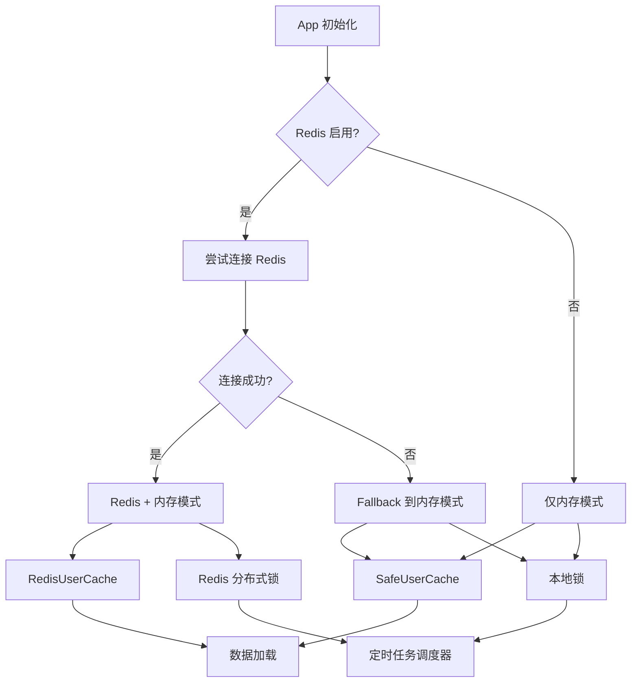

# Redis Fallback 和可选支持架构设计

## 架构图



## 设计说明

### 1. Redis 启用状态

应用支持三种 Redis 状态：

- **启用且可用** (`redis-enabled=true` 且连接成功)
  - 使用 Redis 缓存和分布式锁
  - 数据加载优先级：Redis 缓存 > 远程 API > 本地文件

- **启用但不可用** (`redis-enabled=true` 但连接失败)
  - 自动降级到内存模式（fallback）
  - 使用本地锁替代分布式锁
  - 数据加载优先级：远程 API > 本地文件

- **禁用** (`redis-enabled=false`)
  - 跳过 Redis 初始化
  - 使用内存缓存和本地锁
  - 数据加载优先级：远程 API > 本地文件

### 2. 锁实现

- **Redis 分布式锁** (`cache.Locker`)
  - 适用于多实例部署
  - 基于 Redis SETNX 实现
  - 支持自动过期，防止死锁

- **本地锁** (`cache.LocalLocker`)
  - 适用于单机部署
  - 基于 `sync.Mutex` 实现
  - 进程退出时自动释放

### 3. 数据加载策略

数据加载采用多级降级策略：

1. **Redis 缓存**（如果 Redis 可用）
2. **远程 API**（如果配置了远程地址）
3. **本地文件**（`data.json`）

### 4. 健康检查状态

健康检查端点 (`/health`) 返回 Redis 状态：

- `"ok"`: Redis 正常
- `"unavailable"`: Redis 连接失败（fallback 模式）
- `"disabled"`: Redis 被显式禁用
- `"not_configured"`: Redis 客户端为 nil（向后兼容）

## 配置参数

### 命令行参数

```bash
--redis-enabled=true|false  # 启用/禁用 Redis（默认: true）
```

### 环境变量

```bash
REDIS_ENABLED=true|false|1|0  # 启用/禁用 Redis（默认: true）
```

### 优先级

命令行参数 > 环境变量 > 配置文件 > 默认值

## 使用示例

### 禁用 Redis

```bash
# 命令行
go run main.go --redis-enabled=false

# 环境变量
export REDIS_ENABLED=false
go run main.go
```

### 启用 Redis（默认）

```bash
go run main.go --redis localhost:6379
```

### Redis 连接失败时自动 fallback

```bash
# Redis 不可用，但应用仍能启动
go run main.go --redis invalid-host:6379
# 会记录警告，但继续使用内存缓存
```

## 注意事项

1. **性能影响**：内存模式下，多实例部署时数据不同步，适合单机部署
2. **数据持久化**：禁用 Redis 后，数据仅存在内存中，重启后丢失
3. **分布式锁**：本地锁仅适用于单机部署，多实例时无法防止重复执行
4. **日志记录**：Redis 不可用时应记录清晰的警告日志，便于运维排查
