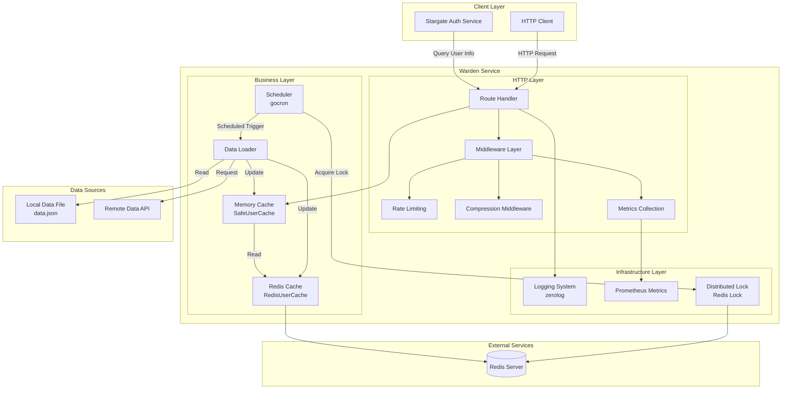
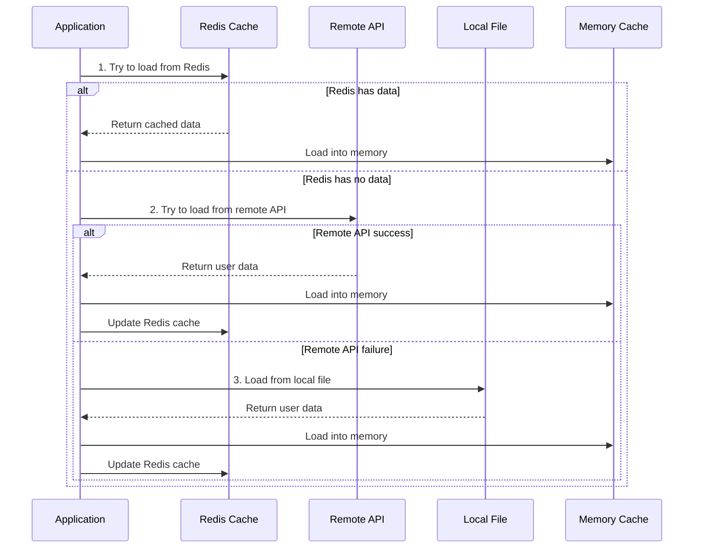
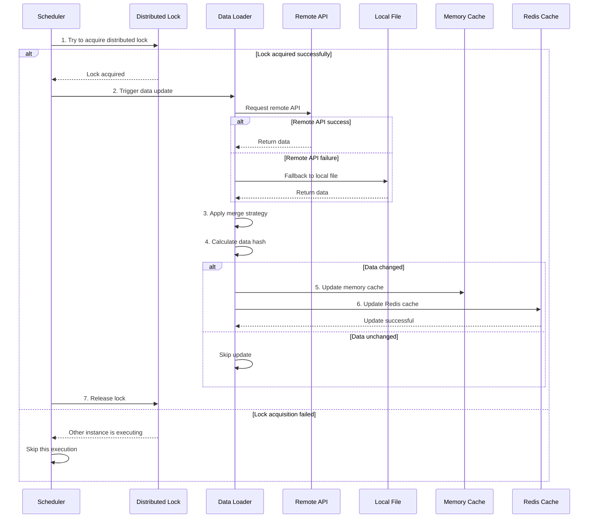
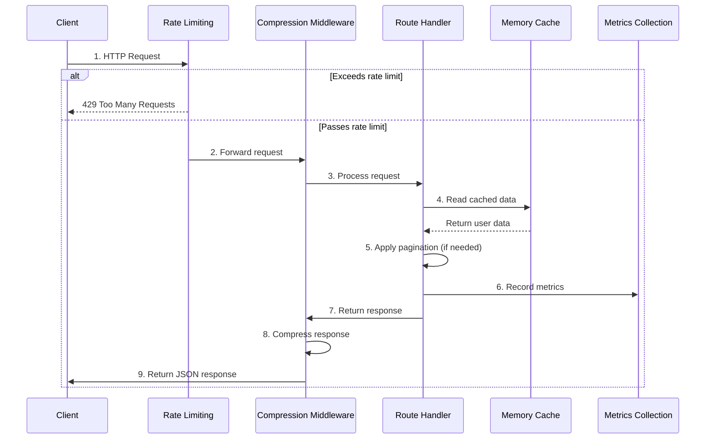
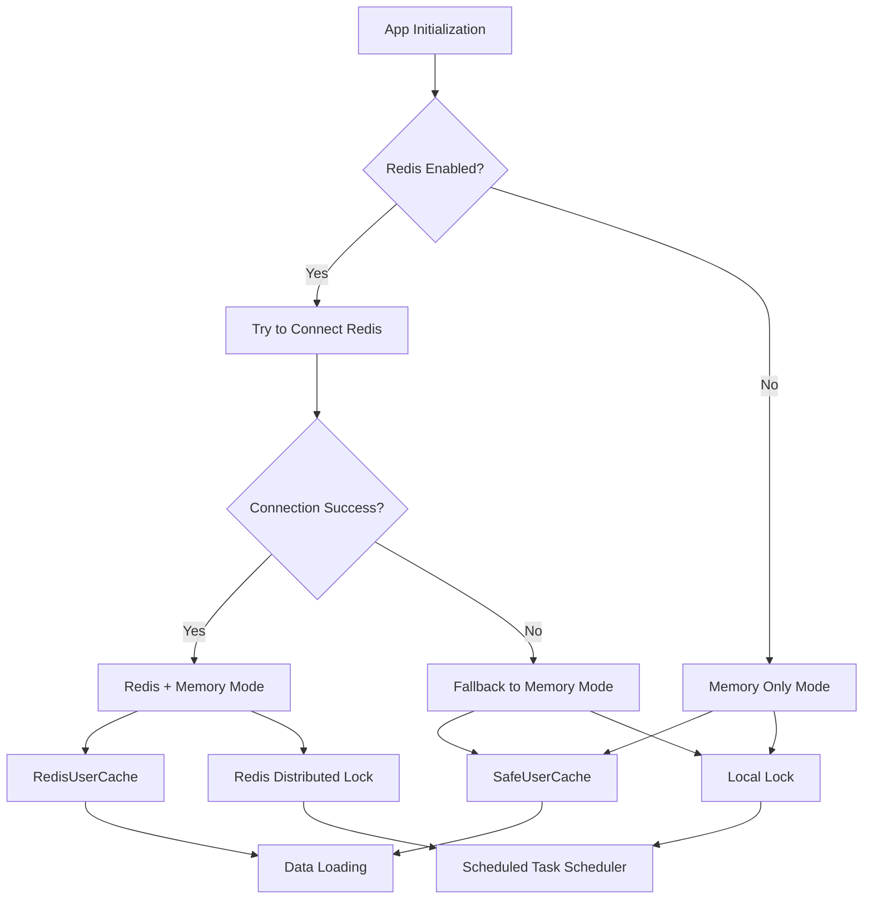
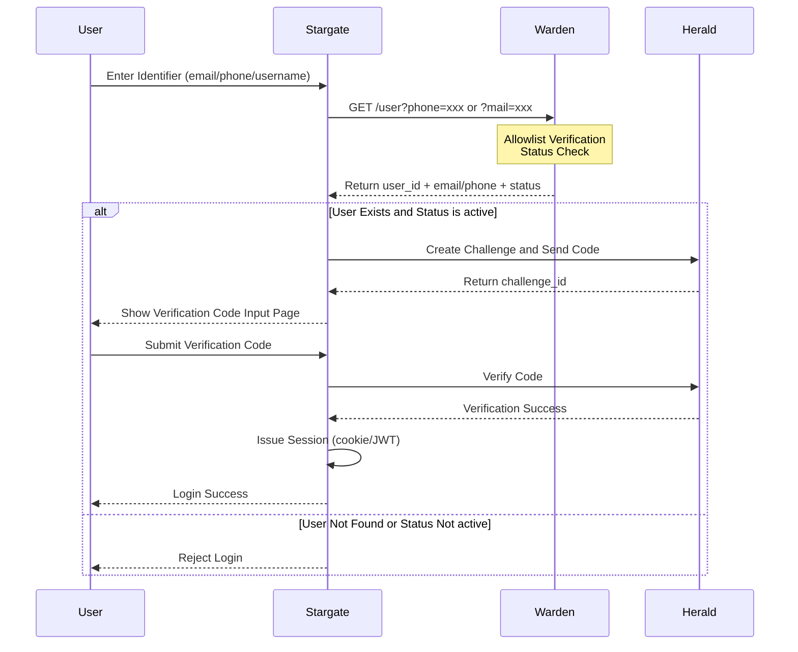

# Architecture Design Documentation

> 🌐 **Language / 语言**: [English](ARCHITECTURE.md) | [中文](../zhCN/ARCHITECTURE.md) | [Français](../frFR/ARCHITECTURE.md) | [Italiano](../itIT/ARCHITECTURE.md) | [日本語](../jaJP/ARCHITECTURE.md) | [Deutsch](../deDE/ARCHITECTURE.md) | [한국어](../koKR/ARCHITECTURE.md)

This document details the system architecture, core components, and data flow of Warden.

Warden is a **standalone** allowlist user data service that can be used independently or optionally integrated with other services.

## System Architecture Diagram



## Core Components

1. **HTTP Server**: Provides JSON API interface to return user list
   - Supports pagination queries
   - Compresses response data
   - Rate limiting protection
   - Request metrics collection

2. **Data Loader** (parser-kit): Loads user data from local files and remote APIs
   - Local file parsing (JSON format)
   - Remote API calls (with authentication support)
   - Multiple data merging strategies

3. **Scheduler**: Uses gocron to periodically update user data
   - Configurable update interval
   - Redis-based distributed locks
   - Prevents duplicate execution

4. **Cache System**: Multi-level cache architecture
   - Memory cache (SafeUserCache): Fast response
   - Redis cache (RedisUserCache): Persistent storage
   - Smart cache update strategy

5. **Logging System**: Structured logging based on zerolog
   - Structured log output
   - Dynamically adjustable log levels
   - Access logs and error logs

6. **Monitoring System**: Prometheus metrics collection
   - HTTP request metrics
   - Cache hit rate
   - Background task execution status

## Data Flow

### Data Loading Flow on Startup



### Scheduled Task Update Flow



### Request Processing Flow



## Data Merging Strategies

The system supports 6 data merging modes, selected based on the `MODE` parameter:

| Mode | Description | Use Case |
|------|-------------|----------|
| `DEFAULT` / `REMOTE_FIRST` | Remote first, use local data as supplement when remote data is unavailable | Default mode, suitable for most scenarios |
| `ONLY_REMOTE` | Only use remote data source | Completely dependent on remote configuration |
| `ONLY_LOCAL` | Only use local configuration file | Offline environment or test environment |
| `LOCAL_FIRST` | Local first, use remote data as supplement when local data is unavailable | Local configuration is primary, remote is secondary |
| `REMOTE_FIRST_ALLOW_REMOTE_FAILED` | Remote first, allow fallback to local when remote fails | High availability scenarios |
| `LOCAL_FIRST_ALLOW_REMOTE_FAILED` | Local first, allow fallback to local when remote fails | Hybrid mode |

For detailed information, please refer to [Configuration Documentation](CONFIGURATION.md).

## Redis Fallback and Optional Support Architecture

### Redis Enabled State Architecture Diagram



### Design Description

#### 1. Redis Enabled State

The application supports three Redis states:

- **Enabled and Available** (`redis-enabled=true` and connection successful)
  - Uses Redis cache and distributed locks
  - Data loading priority: Redis cache > Remote API > Local file

- **Enabled but Unavailable** (`redis-enabled=true` but connection failed)
  - Automatically downgrades to memory mode (fallback)
  - Uses local lock instead of distributed lock
  - Data loading priority: Remote API > Local file

- **Disabled** (`redis-enabled=false`)
  - Skips Redis initialization
  - Uses memory cache and local lock
  - Data loading priority: Remote API > Local file

#### 2. Lock Implementation

- **Redis Distributed Lock** (`cache.Locker`)
  - Suitable for multi-instance deployment
  - Based on Redis SETNX implementation
  - Supports automatic expiration to prevent deadlocks

- **Local Lock** (`cache.LocalLocker`)
  - Suitable for single-machine deployment
  - Based on `sync.Mutex` implementation
  - Automatically released when process exits

#### 3. Data Loading Strategy

Data loading uses a multi-level fallback strategy:

1. **Redis Cache** (if Redis is available)
2. **Remote API** (if remote address is configured)
3. **Local File** (`data.json`)

#### 4. Health Check Status

The health check endpoint (`/health`) returns Redis status:

- `"ok"`: Redis is normal
- `"unavailable"`: Redis connection failed (fallback mode) or Redis client is nil
- `"disabled"`: Redis is explicitly disabled

**Important Notes**:
- In `ONLY_LOCAL` mode, even if Redis is unavailable, the health check will return `200 OK` (because this mode does not depend on Redis)
- If data is loaded (`data_loaded: true`), the service is still healthy even if Redis is unavailable, returning `200 OK`
- Only when not in `ONLY_LOCAL` mode and data is not loaded, Redis unavailability will return `503 Service Unavailable`

### Configuration Parameters

### Command Line Arguments

```bash
--redis-enabled=true|false  # Enable/disable Redis (default: true, but defaults to false in ONLY_LOCAL mode)
                            # Note: In ONLY_LOCAL mode, if --redis address is explicitly set, Redis will be enabled automatically
```

### Environment Variables

```bash
REDIS_ENABLED=true|false|1|0  # Enable/disable Redis (default: true, but defaults to false in ONLY_LOCAL mode)
                              # Note: In ONLY_LOCAL mode, if REDIS address is explicitly set, Redis will be enabled automatically
```

### Priority

Command line arguments > Environment variables > Configuration file > Default value

### Usage Examples

### Disable Redis

```bash
# Command line
go run main.go --redis-enabled=false

# Environment variable
export REDIS_ENABLED=false
go run main.go
```

### Enable Redis (Default)

```bash
go run main.go --redis localhost:6379
```

### Automatic Fallback When Redis Connection Fails

```bash
# Redis unavailable, but application can still start
go run main.go --redis invalid-host:6379
# Will log warning, but continue using memory cache
```

### Notes

1. **Performance Impact**: In memory mode, data is not synchronized across multiple instances, suitable for single-machine deployment
2. **Data Persistence**: After disabling Redis, data only exists in memory and is lost after restart
3. **Distributed Lock**: Local lock is only suitable for single-machine deployment, cannot prevent duplicate execution in multi-instance scenarios
4. **Logging**: When Redis is unavailable, clear warning logs should be recorded for operations troubleshooting

## Optional Service Integration

Warden can be used **standalone** or optionally integrated with other services (such as Stargate and Herald). The following integration scenarios are **optional** and only apply when building a complete authentication architecture.

### Warden Responsibility Boundaries

According to the system architecture design, Warden's responsibility boundaries are as follows:

**Must do**:
- Allowlist user management and queries
- Provide basic user information to Stargate (email/phone/user_id/status)
- Optional: Provide scope/role/resource authorization information (for Stargate to output to downstream services)

**Must not do**:
- ❌ Do not send verification codes
- ❌ Do not perform OTP verification

Verification code and OTP-related functions are handled by the Herald service. Warden is only responsible for user data queries and authorization information provision.

### Stargate + Warden + Herald Architecture (Optional)

If you need to build a complete authentication architecture, Warden can work with Stargate and Herald:

```mermaid
graph TB
    subgraph "User"
        User[User Browser]
    end
    
    subgraph "Gateway Layer"
        Traefik[Traefik<br/>forwardAuth]
    end
    
    subgraph "Auth Service"
        Stargate[Stargate<br/>Auth/Session Management]
    end
    
    subgraph "Data Service"
        Warden[Warden<br/>Allowlist User Data]
    end
    
    subgraph "OTP Service"
        Herald[Herald<br/>Verification Code/OTP]
    end
    
    subgraph "Data Sources"
        LocalFile[Local Data File]
        RemoteAPI[Remote API]
    end
    
    User -->|1. Access Protected Resource| Traefik
    Traefik -->|2. forwardAuth Request| Stargate
    Stargate -->|3. Not Logged In, Redirect to Login| User
    User -->|4. Enter Identifier| Stargate
    Stargate -->|5. Query User| Warden
    Warden -->|Read| LocalFile
    Warden -->|Read| RemoteAPI
    Warden -->|6. Return user_id + email/phone| Stargate
    Stargate -->|7. Create Challenge| Herald
    Herald -->|8. Send Verification Code| User
    User -->|9. Submit Verification Code| Stargate
    Stargate -->|10. Verify Code| Herald
    Herald -->|11. Verification Result| Stargate
    Stargate -->|12. Issue Session| User
    User -->|13. Subsequent Requests| Traefik
    Traefik -->|14. forwardAuth| Stargate
    Stargate -->|15. Validate Session| Stargate
    Stargate -->|16. Return Auth Headers| Traefik
```

### Stargate Calling Warden Flow (Optional Integration Scenario)

In optional integration scenarios, Stargate can call Warden to query user information in the login flow:



### Data Flow

1. **Login Flow** (First-time Authentication):
   - Stargate → Warden: Query user information (allowlist verification, status check)
   - Stargate → Herald: Create challenge and send verification code
   - Stargate → Herald: Verify verification code
   - Stargate: Issue session

2. **Subsequent Requests** (Already Logged In):
   - Traefik forwardAuth → Stargate: Validate session
   - Stargate: Return authorization headers (`X-Auth-User`, `X-Auth-Email`, `X-Auth-Scopes`, `X-Auth-Role`)
   - **No longer calls Warden/Herald** (unless authorization information needs to be refreshed)

### Inter-Service Authentication (Optional)

If you choose to integrate, inter-service authentication can be used when Stargate calls Warden. The following methods are supported:

- **mTLS** (Recommended): Use mutual TLS certificates for authentication
- **HMAC Signature**: Use HMAC-SHA256 signature to verify requests

**Note**: If Warden is used standalone, inter-service authentication is optional. For detailed configuration, please refer to [Security Documentation](SECURITY.md#inter-service-authentication).

## Related Documentation

- [Configuration Documentation](CONFIGURATION.md) - Learn about detailed configuration options
- [Deployment Documentation](DEPLOYMENT.md) - Learn about deployment architecture
- [Development Documentation](DEVELOPMENT.md) - Learn about development-related architecture
- [Security Documentation](SECURITY.md) - Learn about inter-service authentication configuration
