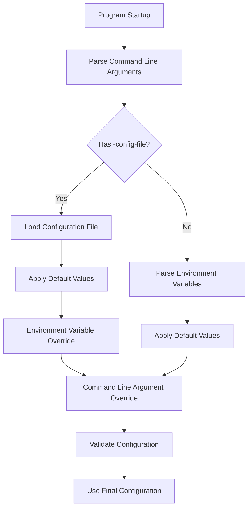

# Program Parameter Parsing Design Documentation

## Overview

This document details the parameter parsing mechanism of the warden program, including command-line arguments, environment variables, and configuration file parsing methods, priority rules, and usage examples.

## Table of Contents

- [Architecture Design](#architecture-design)
- [Priority Mechanism](#priority-mechanism)
- [Supported Parameters](#supported-parameters)
- [Usage Methods](#usage-methods)
- [Best Practices](#best-practices)
- [Common Questions](#common-questions)

---

## Architecture Design

### Parsing Flow



### Core Components

1. **`cmd.GetArgs()`** - Main entry function that coordinates the entire parsing flow
2. **`config.LoadFromFile()`** - Configuration file loader
3. **`overrideFromEnv()`** - Environment variable override logic
4. **`overrideWithFlags()`** - Command line argument override logic

### Design Principles

- **Backward Compatibility**: Maintains support for old parameter formats
- **Flexibility**: Supports multiple configuration methods (CLI, environment variables, configuration files)
- **Security**: Sensitive information (such as passwords) should preferably use environment variables or files
- **Consistency**: All configuration sources use the same validation rules

---

## Priority Mechanism

### Priority Order

```
Command Line Arguments > Environment Variables > Configuration File > Default Values
```

### Detailed Explanation

1. **Command Line Arguments** (Highest Priority)
   - Passed via `--flag` or `-flag`
   - Overrides values from all other configuration sources
   - Suitable for temporary debugging or overriding specific configurations

2. **Environment Variables**
   - Higher priority than configuration files
   - Suitable for containerized deployments and CI/CD environments
   - Sensitive information (such as passwords) recommended to use environment variables

3. **Configuration File**
   - YAML format, supports structured configuration
   - Suitable for complex configurations and version control
   - Specified via `--config-file` parameter

4. **Default Values**
   - Used when all configuration sources are not provided
   - Defined in `internal/define/define.go`

### Special Rules

#### Redis Password Priority

Redis password has special priority rules:

```
Environment Variable REDIS_PASSWORD > Password File REDIS_PASSWORD_FILE > Command Line Argument --redis-password > Configuration File
```

#### Boolean Flag Handling

Boolean flags (such as `--redis-enabled`, `--http-insecure-tls`):
- If explicitly set (via CLI or environment variable), will override values in configuration files
- Environment variables support: `true`/`false`/`1`/`0` (case-insensitive)

---

## Supported Parameters

### Server Configuration

#### PORT

- **CLI Argument**: `--port <port number>`
- **Environment Variable**: `PORT`
- **Configuration File**: `server.port`
- **Type**: Integer (1-65535)
- **Default Value**: `8081`
- **Description**: HTTP server listening port

**Example**:
```bash
# CLI
./warden --port 9090

# Environment Variable
export PORT=9090
./warden

# Configuration File
server:
  port: "9090"
```

---

### Redis Configuration

#### REDIS

- **CLI Argument**: `--redis <host:port>`
- **Environment Variable**: `REDIS`
- **Configuration File**: `redis.addr`
- **Type**: String (format: `host:port`)
- **Default Value**: `localhost:6379`
- **Description**: Redis server address

**Example**:
```bash
# CLI
./warden --redis 192.168.1.100:6379

# Environment Variable
export REDIS=192.168.1.100:6379
./warden
```

#### REDIS_PASSWORD

- **CLI Argument**: `--redis-password <password>`
- **Environment Variable**: `REDIS_PASSWORD`
- **Configuration File**: `redis.password`
- **Type**: String
- **Default Value**: Empty string
- **Description**: Redis password (sensitive information, recommended to use environment variable)
- **Security Note**: ⚠️ Not recommended to pass password via command line arguments

**Example**:
```bash
# Environment Variable (Recommended)
export REDIS_PASSWORD=your_password
./warden

# Password File (Recommended, More Secure)
export REDIS_PASSWORD_FILE=/path/to/password.txt
./warden
```

#### REDIS_PASSWORD_FILE

- **Environment Variable**: `REDIS_PASSWORD_FILE`
- **Configuration File**: `redis.password_file`
- **Type**: File path
- **Default Value**: Empty string
- **Description**: Redis password file path (file content will be read as password)
- **Priority**: Lower than `REDIS_PASSWORD` environment variable, higher than configuration file

**Example**:
```bash
# Create Password File
echo "your_password" > /secure/path/redis_password.txt
chmod 600 /secure/path/redis_password.txt

# Use Password File
export REDIS_PASSWORD_FILE=/secure/path/redis_password.txt
./warden
```

#### REDIS_ENABLED

- **CLI Argument**: `--redis-enabled` / `--redis-enabled=false`
- **Environment Variable**: `REDIS_ENABLED`
- **Type**: Boolean
- **Default Value**: `true`
- **Description**: Whether to enable Redis (after disabling, uses pure memory mode)
- **Supported Values**: `true`/`false`/`1`/`0` (environment variable, case-insensitive)

**Example**:
```bash
# CLI
./warden --redis-enabled=false

# Environment Variable
export REDIS_ENABLED=false
./warden
```

---

### Remote Configuration

#### CONFIG

- **CLI Argument**: `--config <URL>`
- **Environment Variable**: `CONFIG`
- **Configuration File**: `remote.url`
- **Type**: URL string
- **Default Value**: `http://localhost:8080/data.json`
- **Description**: Remote data source URL

**Example**:
```bash
# CLI
./warden --config https://api.example.com/users.json

# Environment Variable
export CONFIG=https://api.example.com/users.json
./warden
```

#### KEY

- **CLI Argument**: `--key <key>`
- **Environment Variable**: `KEY`
- **Configuration File**: `remote.key`
- **Type**: String
- **Default Value**: Empty string
- **Description**: Authentication key for remote configuration (used for Authorization header)

**Example**:
```bash
# CLI
./warden --key Bearer your_token_here

# Environment Variable
export KEY=Bearer your_token_here
./warden
```

---

### Application Mode

#### MODE

- **CLI Argument**: `--mode <mode>`
- **Environment Variable**: `MODE`
- **Configuration File**: `remote.mode` or `app.mode`
- **Type**: String
- **Default Value**: `DEFAULT`
- **Optional Values**:
  - `DEFAULT` - Default mode (remote first, fallback to local on failure)
  - `REMOTE_FIRST` - Remote first
  - `ONLY_REMOTE` - Only remote
  - `ONLY_LOCAL` - Only local
  - `LOCAL_FIRST` - Local first
  - `REMOTE_FIRST_ALLOW_REMOTE_FAILED` - Remote first, allow remote failure
  - `LOCAL_FIRST_ALLOW_REMOTE_FAILED` - Local first, allow remote failure

**Example**:
```bash
# CLI
./warden --mode ONLY_LOCAL

# Environment Variable
export MODE=ONLY_LOCAL
./warden
```

---

### Task Configuration

#### INTERVAL

- **CLI Argument**: `--interval <seconds>`
- **Environment Variable**: `INTERVAL`
- **Configuration File**: `task.interval`
- **Type**: Integer (seconds)
- **Default Value**: `5`
- **Description**: Background task execution interval (seconds)

**Example**:
```bash
# CLI
./warden --interval 10

# Environment Variable
export INTERVAL=10
./warden
```

---

### HTTP Client Configuration

#### HTTP_TIMEOUT

- **CLI Argument**: `--http-timeout <seconds>`
- **Environment Variable**: `HTTP_TIMEOUT`
- **Configuration File**: `http.timeout`
- **Type**: Integer (seconds) or Duration string
- **Default Value**: `5`
- **Description**: HTTP request timeout
- **Format Support**:
  - Integer seconds: `"30"` → 30 seconds
  - Duration format: `"30s"` → 30 seconds, `"1m30s"` → 90 seconds

**Example**:
```bash
# CLI (seconds)
./warden --http-timeout 30

# Environment Variable (supports both formats)
export HTTP_TIMEOUT=30        # Integer seconds
export HTTP_TIMEOUT=30s      # Duration format
export HTTP_TIMEOUT=1m30s    # Duration format
./warden
```

#### HTTP_MAX_IDLE_CONNS

- **CLI Argument**: `--http-max-idle-conns <count>`
- **Environment Variable**: `HTTP_MAX_IDLE_CONNS`
- **Configuration File**: `http.max_idle_conns`
- **Type**: Integer
- **Default Value**: `100`
- **Description**: HTTP client maximum idle connections

**Example**:
```bash
# CLI
./warden --http-max-idle-conns 200

# Environment Variable
export HTTP_MAX_IDLE_CONNS=200
./warden
```

#### HTTP_INSECURE_TLS

- **CLI Argument**: `--http-insecure-tls` / `--http-insecure-tls=false`
- **Environment Variable**: `HTTP_INSECURE_TLS`
- **Configuration File**: `http.insecure_tls`
- **Type**: Boolean
- **Default Value**: `false`
- **Description**: Whether to skip TLS certificate verification (only for development environment)
- **Security Warning**: ⚠️ Production environment must not disable TLS verification
- **Supported Values**: `true`/`false`/`1`/`0` (environment variable, case-insensitive)

**Example**:
```bash
# CLI
./warden --http-insecure-tls

# Environment Variable
export HTTP_INSECURE_TLS=true
./warden
```

---

### Authentication Configuration

#### API_KEY

- **CLI Argument**: `--api-key <key>`
- **Environment Variable**: `API_KEY`
- **Configuration File**: `app.api_key`
- **Type**: String
- **Default Value**: Empty string
- **Description**: API authentication key (used to protect API endpoints)
- **Security Note**: ⚠️ Strongly recommended to use environment variable, do not write to configuration file

**Example**:
```bash
# CLI (not recommended for production)
./warden --api-key your_api_key_here

# Environment Variable (Recommended)
export API_KEY=your_api_key_here
./warden
```

---

### Configuration File

#### CONFIG_FILE

- **CLI Argument**: `--config-file <path>`
- **Type**: File path
- **Default Value**: Empty string (do not use configuration file)
- **Description**: Configuration file path (supports YAML format)

**Example**:
```bash
# Use Configuration File
./warden --config-file /path/to/config.yaml

# Configuration file example see config.example.yaml
```

---

### Other Environment Variables

The following environment variables are not parsed through `cmd.GetArgs()`, but will be used during program runtime:

#### LOG_LEVEL

- **Environment Variable**: `LOG_LEVEL`
- **Type**: String
- **Default Value**: `info`
- **Optional Values**: `trace`, `debug`, `info`, `warn`, `error`, `fatal`, `panic`
- **Description**: Log output level

**Example**:
```bash
export LOG_LEVEL=debug
./warden
```

#### HEALTH_CHECK_IP_WHITELIST

- **Environment Variable**: `HEALTH_CHECK_IP_WHITELIST`
- **Type**: String (comma-separated IPs or CIDR ranges)
- **Default Value**: Empty string (no restriction)
- **Description**: IP whitelist for health check endpoints (`/health`, `/healthcheck`)

**Example**:
```bash
# Single IP
export HEALTH_CHECK_IP_WHITELIST=127.0.0.1
./warden

# Multiple IPs and CIDR ranges
export HEALTH_CHECK_IP_WHITELIST=127.0.0.1,::1,10.0.0.0/8
./warden
```

#### IP_WHITELIST

- **Environment Variable**: `IP_WHITELIST`
- **Type**: String (comma-separated IPs or CIDR ranges)
- **Default Value**: Empty string (no restriction)
- **Description**: Global IP whitelist (restricts access to all endpoints)

**Example**:
```bash
export IP_WHITELIST=192.168.1.0/24,10.0.0.0/8
./warden
```

#### TRUSTED_PROXY_IPS

- **Environment Variable**: `TRUSTED_PROXY_IPS`
- **Type**: String (comma-separated IP addresses)
- **Default Value**: Empty string
- **Description**: Trusted reverse proxy IP list, used to correctly obtain client real IP (from `X-Forwarded-For` and other headers)

**Example**:
```bash
export TRUSTED_PROXY_IPS=127.0.0.1,10.0.0.1,172.16.0.1
./warden
```

---

## Usage Methods

### Method 1: Command Line Arguments Only

Suitable for quick startup and testing:

```bash
./warden \
  --port 8081 \
  --redis localhost:6379 \
  --config https://api.example.com/data.json \
  --key Bearer token123 \
  --mode DEFAULT \
  --interval 5
```

### Method 2: Environment Variables

Suitable for containerized deployments and CI/CD:

```bash
export PORT=8081
export REDIS=localhost:6379
export REDIS_PASSWORD=your_password
export CONFIG=https://api.example.com/data.json
export KEY=Bearer token123
export MODE=DEFAULT
export INTERVAL=5
export API_KEY=your_api_key

./warden
```

### Method 3: Configuration File

Suitable for complex configurations and version control:

```bash
# Create Configuration File
cat > config.yaml <<EOF
server:
  port: "8081"

redis:
  addr: "localhost:6379"
  # Password set via environment variable

remote:
  url: "https://api.example.com/data.json"
  key: "Bearer token123"
  mode: "DEFAULT"

task:
  interval: 5s

app:
  mode: "DEFAULT"
  # API Key set via environment variable
EOF

# Start Program
./warden --config-file config.yaml
```

### Method 4: Mixed Usage (Recommended)

Combine configuration file and environment variables, command line arguments for temporary overrides:

```bash
# Basic configuration in file
./warden --config-file config.yaml

# Temporarily override port
./warden --config-file config.yaml --port 9090

# Use environment variables to override sensitive information
export REDIS_PASSWORD=your_password
export API_KEY=your_api_key
./warden --config-file config.yaml
```

---

## Best Practices

### 1. Sensitive Information Management

✅ **Recommended Practices**:
- Use environment variables to store passwords and keys
- Use password files (`REDIS_PASSWORD_FILE`) to store Redis passwords
- Use placeholders or comments in configuration files

❌ **Not Recommended Practices**:
- Hardcode passwords in configuration files
- Pass passwords via command line arguments (will appear in process list)
- Commit configuration files containing sensitive information to version control

**Example**:
```yaml
# config.yaml
redis:
  addr: "localhost:6379"
  # password: ""  # Use environment variable REDIS_PASSWORD or REDIS_PASSWORD_FILE

app:
  # api_key: ""  # Use environment variable API_KEY
```

### 2. Configuration File Organization

✅ **Recommended Practices**:
- Create different configuration files for different environments (`config.dev.yaml`, `config.prod.yaml`)
- Use version control to manage configuration file templates
- Add comments in configuration files

❌ **Not Recommended Practices**:
- Include sensitive information in configuration files
- Use absolute paths (not conducive to cross-environment deployment)

### 3. Containerized Deployment

In Docker/Kubernetes environments:

```yaml
# docker-compose.yml
services:
  warden:
    image: warden:latest
    environment:
      - PORT=8081
      - REDIS=redis:6379
      - REDIS_PASSWORD_FILE=/run/secrets/redis_password
      - CONFIG=https://api.example.com/data.json
      - KEY=Bearer ${API_TOKEN}
      - MODE=DEFAULT
      - API_KEY=${WARDEN_API_KEY}
    secrets:
      - redis_password
```

### 4. Development Environment Configuration

Development environment can use more relaxed configuration:

```bash
# .env (Development Environment)
PORT=8081
REDIS=localhost:6379
CONFIG=http://localhost:8080/data.json
MODE=ONLY_LOCAL
HTTP_INSECURE_TLS=true  # Development only
```

### 5. Production Environment Configuration

Production environment should:

- ✅ Use environment variables to manage all sensitive information
- ✅ Disable `HTTP_INSECURE_TLS`
- ✅ Use strong passwords and API keys
- ✅ Enable Redis (if available)
- ✅ Use appropriate running mode (such as `REMOTE_FIRST`)

```bash
# Production Environment Startup Script
#!/bin/bash
export PORT=${PORT:-8081}
export REDIS=${REDIS:-redis:6379}
export REDIS_PASSWORD_FILE=/run/secrets/redis_password
export CONFIG=${CONFIG:-https://api.example.com/data.json}
export KEY=${KEY:-Bearer ${API_TOKEN}}
export MODE=${MODE:-REMOTE_FIRST}
export API_KEY=${WARDEN_API_KEY}
export HTTP_INSECURE_TLS=false  # Must be false in production

./warden --config-file /etc/warden/config.yaml
```

---

## Common Questions

### Q1: Why do command line arguments override environment variables?

**A**: This is a design decision. Command line arguments have the highest priority, allowing users to temporarily override configurations at runtime, facilitating debugging and testing.

### Q2: How to view the currently used configuration?

**A**: The program outputs configuration information to logs at startup. You can also view partial configuration information (excluding sensitive information) through the health check endpoint `/health`.

### Q3: What formats does HTTP_TIMEOUT support?

**A**: Supports two formats:
- Integer seconds: `"30"` → 30 seconds
- Duration format: `"30s"`, `"1m30s"`, `"2h"`, etc.

### Q4: What is the priority of Redis password?

**A**: Priority order:
1. Environment variable `REDIS_PASSWORD`
2. Password file `REDIS_PASSWORD_FILE`
3. Command line argument `--redis-password`
4. Configuration file `redis.password`

### Q5: How to disable Redis?

**A**: Can be disabled in the following ways:
```bash
# CLI
./warden --redis-enabled=false

# Environment Variable
export REDIS_ENABLED=false
./warden
```

**Note**: In `ONLY_LOCAL` mode, Redis is disabled by default, no additional configuration needed. If you need to enable Redis, you can do so in the following ways:

1. **Explicitly set Redis address** (Recommended, will automatically enable Redis):
```bash
# Setting REDIS address will automatically enable Redis
MODE=ONLY_LOCAL REDIS=localhost:6379 ./warden
# Or use command line argument
./warden --mode ONLY_LOCAL --redis localhost:6379
```

2. **Explicitly set REDIS_ENABLED**:
```bash
# Explicitly enable Redis
MODE=ONLY_LOCAL REDIS_ENABLED=true ./warden
```

### Q6: What happens if configuration file loading fails?

**A**: If the specified configuration file fails to load, the program will:
- If `--config-file` parameter is provided but file loading fails, fall back to using command line arguments and environment variables
- If configuration file format is incorrect, return error and exit

### Q7: Are environment variable names case-sensitive?

**A**: In Unix/Linux systems, environment variable names are case-sensitive. Please ensure correct case is used (such as `REDIS_PASSWORD` instead of `redis_password`).

### Q8: How to verify if configuration is correct?

**A**: The program performs configuration validation at startup. If configuration is invalid, it will output error information and exit. You can also use the `cmd.ValidateConfig()` function in code to validate configuration.

---

## Related Documentation

- [Architecture Design Documentation](./ARCHITECTURE.md) - Learn about overall architecture
- [Configuration File Example](../config.example.yaml) - View configuration file format
- [Code Implementation](../internal/cmd/cmd.go) - View parameter parsing implementation
- [Environment Variable Check Report](../ENV_CLI_CHECK_REPORT.md) - Learn about parsing mechanism validation
