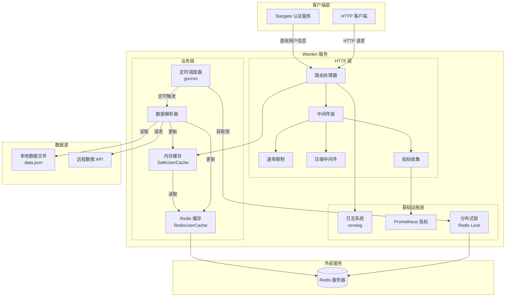
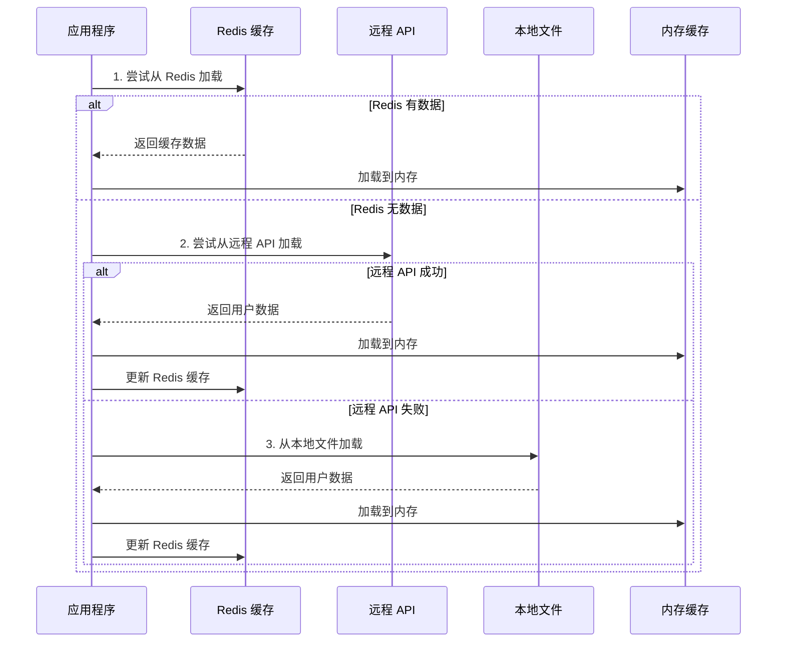
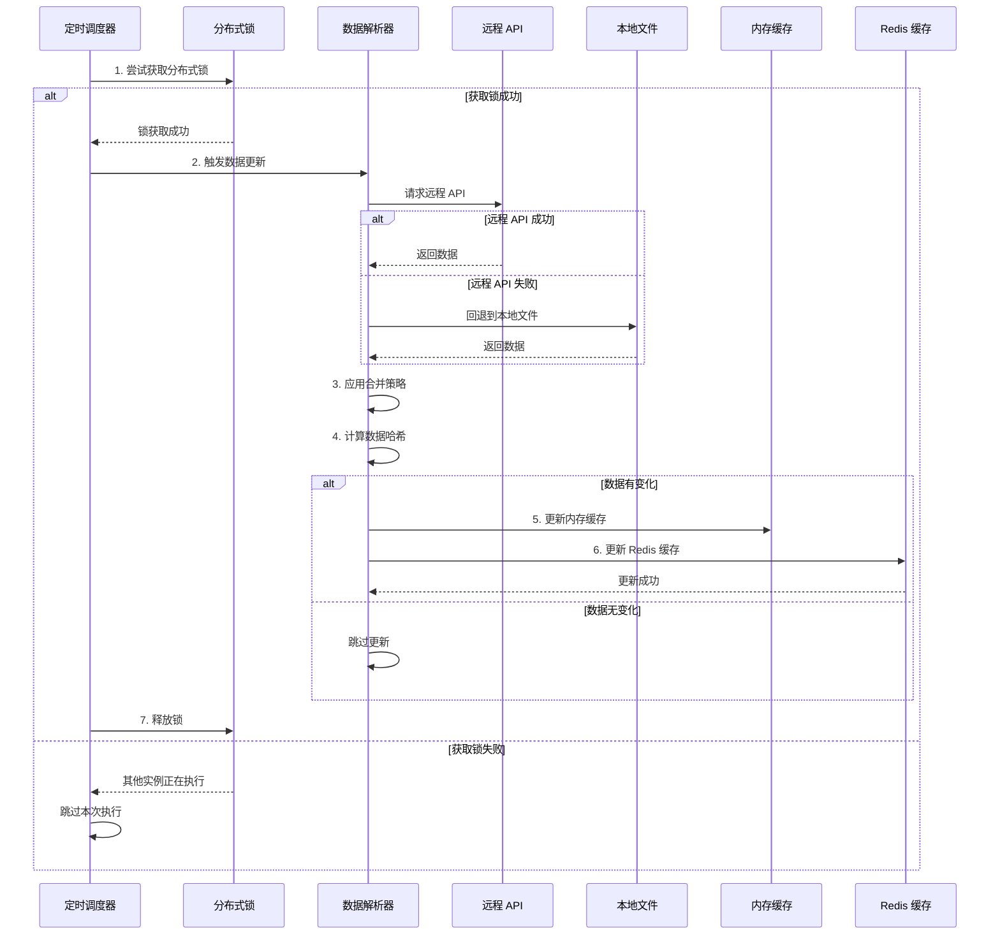
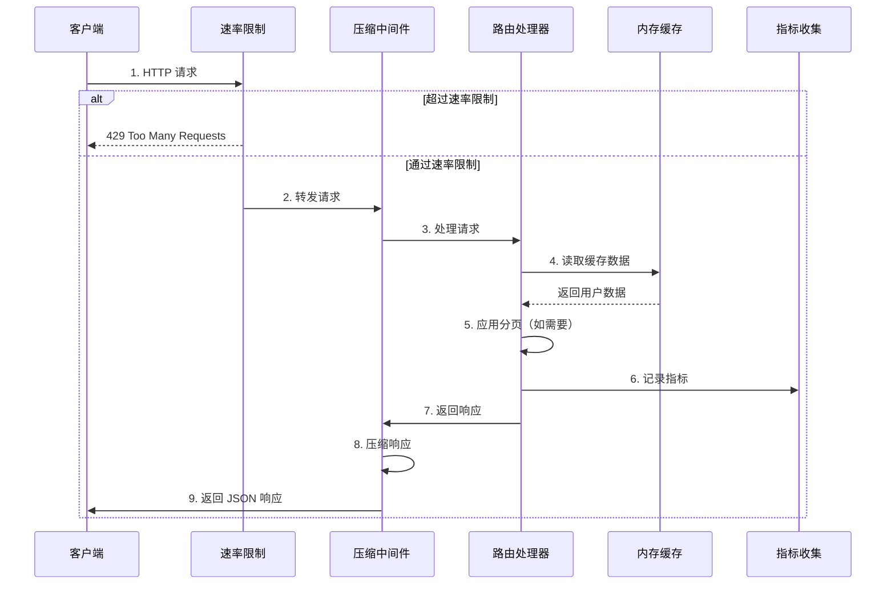
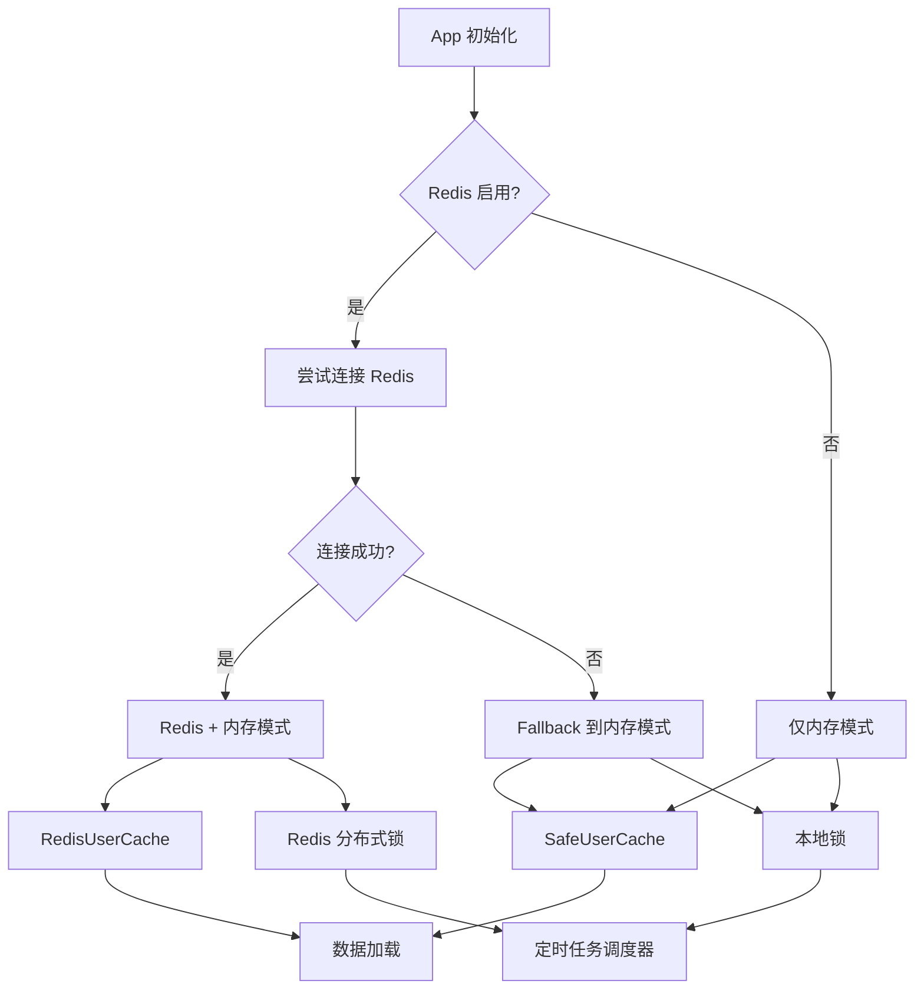
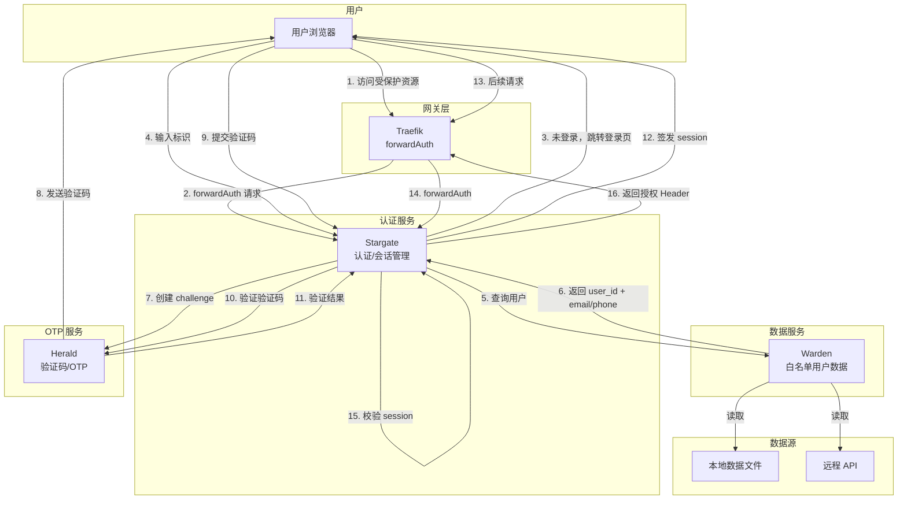
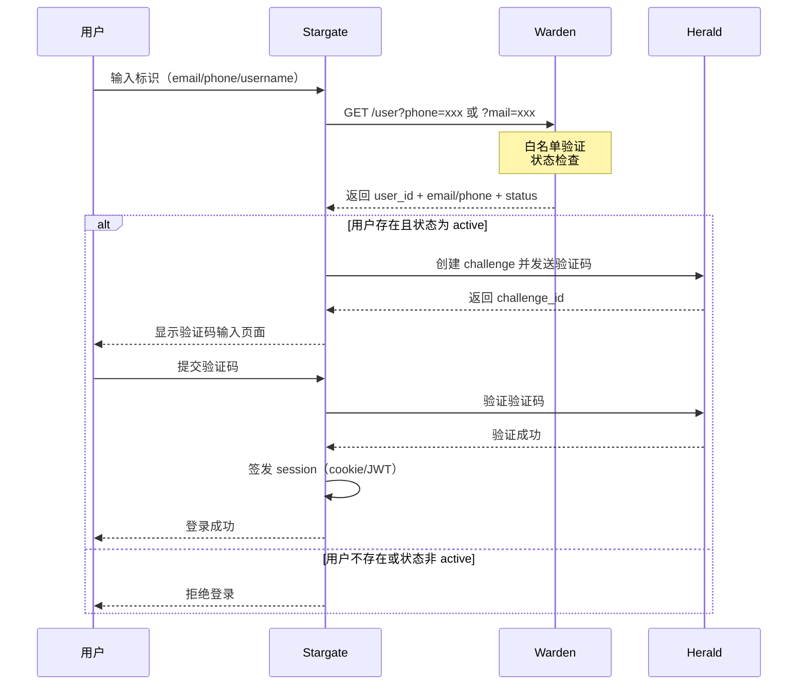

# 架构设计文档

> 🌐 **Language / 语言**: [English](../enUS/ARCHITECTURE.md) | [中文](ARCHITECTURE.md) | [Français](../frFR/ARCHITECTURE.md) | [Italiano](../itIT/ARCHITECTURE.md) | [日本語](../jaJP/ARCHITECTURE.md) | [Deutsch](../deDE/ARCHITECTURE.md) | [한국어](../koKR/ARCHITECTURE.md)

本文档详细说明 Warden 的系统架构、核心组件和数据流程。

Warden 是一个**独立**的允许列表用户数据服务，可以单独使用，也可以选择性地与其他服务集成。

## 系统架构图



## 核心组件

1. **HTTP 服务器**: 提供 JSON API 接口返回用户列表
   - 支持分页查询
   - 压缩响应数据
   - 速率限制保护
   - 请求指标收集

2. **数据解析器**: 支持从本地文件和远程 API 解析用户数据
   - 本地文件解析（JSON 格式）
   - 远程 API 调用（支持认证）
   - 多种数据合并策略

3. **定时调度器**: 使用 gocron 定期更新用户数据
   - 可配置的更新间隔
   - 基于 Redis 的分布式锁
   - 防止重复执行

4. **缓存系统**: 多级缓存架构
   - 内存缓存（SafeUserCache）：快速响应
   - Redis 缓存（RedisUserCache）：持久化存储
   - 智能缓存更新策略

5. **日志系统**: 基于 zerolog 的结构化日志记录
   - 结构化日志输出
   - 可动态调整日志级别
   - 访问日志和错误日志

6. **监控系统**: Prometheus 指标收集
   - HTTP 请求指标
   - 缓存命中率
   - 后台任务执行情况

## 数据流程

### 启动时数据加载流程



### 定时任务更新流程



### 请求处理流程



## 数据合并策略

系统支持 6 种数据合并模式，根据 `MODE` 参数选择：

| 模式 | 说明 | 使用场景 |
|------|------|----------|
| `DEFAULT` / `REMOTE_FIRST` | 远程优先，远程数据不存在时使用本地数据补充 | 默认模式，适合大多数场景 |
| `ONLY_REMOTE` | 仅使用远程数据源 | 完全依赖远程配置 |
| `ONLY_LOCAL` | 仅使用本地配置文件 | 离线环境或测试环境 |
| `LOCAL_FIRST` | 本地优先，本地数据不存在时使用远程数据补充 | 本地配置为主，远程为辅 |
| `REMOTE_FIRST_ALLOW_REMOTE_FAILED` | 远程优先，允许远程失败时回退到本地 | 高可用场景 |
| `LOCAL_FIRST_ALLOW_REMOTE_FAILED` | 本地优先，允许远程失败时回退到本地 | 混合模式 |

详细说明请参考 [配置文档](CONFIGURATION.md)。

## Redis Fallback 和可选支持架构

### Redis 启用状态架构图



### 设计说明

#### 1. Redis 启用状态

应用支持三种 Redis 状态：

- **启用且可用** (`redis-enabled=true` 且连接成功)
  - 使用 Redis 缓存和分布式锁
  - 数据加载优先级：Redis 缓存 > 远程 API > 本地文件

- **启用但不可用** (`redis-enabled=true` 但连接失败)
  - 自动降级到内存模式（fallback）
  - 使用本地锁替代分布式锁
  - 数据加载优先级：远程 API > 本地文件

- **禁用** (`redis-enabled=false`)
  - 跳过 Redis 初始化
  - 使用内存缓存和本地锁
  - 数据加载优先级：远程 API > 本地文件

#### 2. 锁实现

- **Redis 分布式锁** (`cache.Locker`)
  - 适用于多实例部署
  - 基于 Redis SETNX 实现
  - 支持自动过期，防止死锁

- **本地锁** (`cache.LocalLocker`)
  - 适用于单机部署
  - 基于 `sync.Mutex` 实现
  - 进程退出时自动释放

#### 3. 数据加载策略

数据加载采用多级降级策略：

1. **Redis 缓存**（如果 Redis 可用）
2. **远程 API**（如果配置了远程地址）
3. **本地文件**（`data.json`）

#### 4. 健康检查状态

健康检查端点 (`/health`) 返回 Redis 状态：

- `"ok"`: Redis 正常
- `"unavailable"`: Redis 连接失败（fallback 模式）或 Redis 客户端为 nil
- `"disabled"`: Redis 被显式禁用

**重要说明**：
- 在 `ONLY_LOCAL` 模式下，即使 Redis 不可用，健康检查也会返回 `200 OK`（因为该模式不依赖 Redis）
- 如果数据已加载（`data_loaded: true`），即使 Redis 不可用，服务仍然健康，返回 `200 OK`
- 只有在非 `ONLY_LOCAL` 模式且数据未加载时，Redis 不可用才会返回 `503 Service Unavailable`

### 配置参数

### 命令行参数

```bash
--redis-enabled=true|false  # 启用/禁用 Redis（默认: true，但在 ONLY_LOCAL 模式下默认为 false）
                            # 注意: 在 ONLY_LOCAL 模式下，如果显式设置了 --redis 地址，会自动启用 Redis
```

### 环境变量

```bash
REDIS_ENABLED=true|false|1|0  # 启用/禁用 Redis（默认: true，但在 ONLY_LOCAL 模式下默认为 false）
                              # 注意: 在 ONLY_LOCAL 模式下，如果显式设置了 REDIS 地址，会自动启用 Redis
```

### 优先级

命令行参数 > 环境变量 > 配置文件 > 默认值

### 使用示例

### 禁用 Redis

```bash
# 命令行
go run main.go --redis-enabled=false

# 环境变量
export REDIS_ENABLED=false
go run main.go
```

### 启用 Redis（默认）

```bash
go run main.go --redis localhost:6379
```

### Redis 连接失败时自动 fallback

```bash
# Redis 不可用，但应用仍能启动
go run main.go --redis invalid-host:6379
# 会记录警告，但继续使用内存缓存
```

### 注意事项

1. **性能影响**：内存模式下，多实例部署时数据不同步，适合单机部署
2. **数据持久化**：禁用 Redis 后，数据仅存在内存中，重启后丢失
3. **分布式锁**：本地锁仅适用于单机部署，多实例时无法防止重复执行
4. **日志记录**：Redis 不可用时应记录清晰的警告日志，便于运维排查

## 可选服务集成

Warden 可以**独立使用**，也可以选择性地与其他服务（如 Stargate 和 Herald）集成。以下集成方案是**可选的**，仅适用于需要构建完整认证架构的场景。

### Warden 职责边界

根据系统架构设计，Warden 的职责边界如下：

**必须做**：
- 白名单用户管理与查询
- 提供用户基本信息给 Stargate（email/phone/user_id/status）
- 可选：提供 scope/role/资源授权信息（用于 Stargate 输出到下游）

**禁止做**：
- ❌ 不发送验证码
- ❌ 不进行 OTP 校验

验证码和 OTP 相关功能由 Herald 服务负责，Warden 只负责用户数据查询和授权信息提供。

### Stargate + Warden + Herald 架构（可选）

如果需要构建完整的认证架构，Warden 可以与 Stargate 和 Herald 协同工作：



### Stargate 调用 Warden 流程（可选集成场景）

在可选的集成场景中，登录流程中 Stargate 可以调用 Warden 查询用户信息：



### 数据流向

1. **登录流程**（首次认证）：
   - Stargate → Warden：查询用户信息（白名单验证、状态检查）
   - Stargate → Herald：创建 challenge 并发送验证码
   - Stargate → Herald：验证验证码
   - Stargate：签发 session

2. **后续请求**（已登录）：
   - Traefik forwardAuth → Stargate：校验 session
   - Stargate：返回授权 Header（`X-Auth-User`、`X-Auth-Email`、`X-Auth-Scopes`、`X-Auth-Role`）
   - **不再调用 Warden/Herald**（除非需要刷新授权信息）

### 服务间鉴权（可选）

如果选择集成使用，Stargate 调用 Warden 时可以进行服务间鉴权，支持以下方式：

- **mTLS**（推荐）：使用双向 TLS 证书进行身份验证
- **HMAC 签名**：使用 HMAC-SHA256 签名验证请求

**注意**：如果 Warden 独立使用，服务间鉴权是可选的。详细配置请参考 [安全文档](SECURITY.md#服务间鉴权)。

## 相关文档

- [配置文档](CONFIGURATION.md) - 了解详细的配置选项
- [部署文档](DEPLOYMENT.md) - 了解部署架构
- [开发文档](DEVELOPMENT.md) - 了解开发相关架构
- [安全文档](SECURITY.md) - 了解服务间鉴权配置
