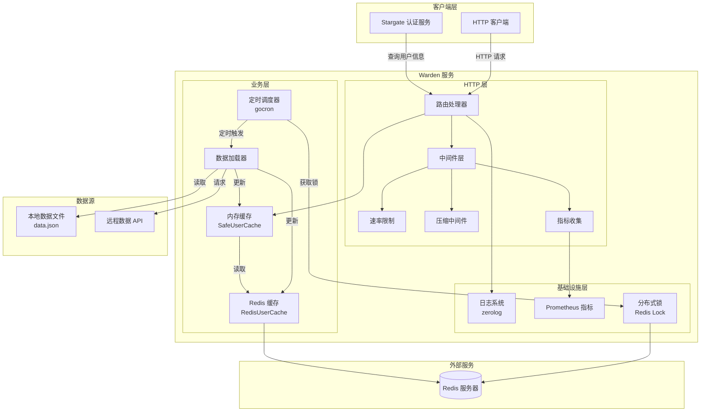
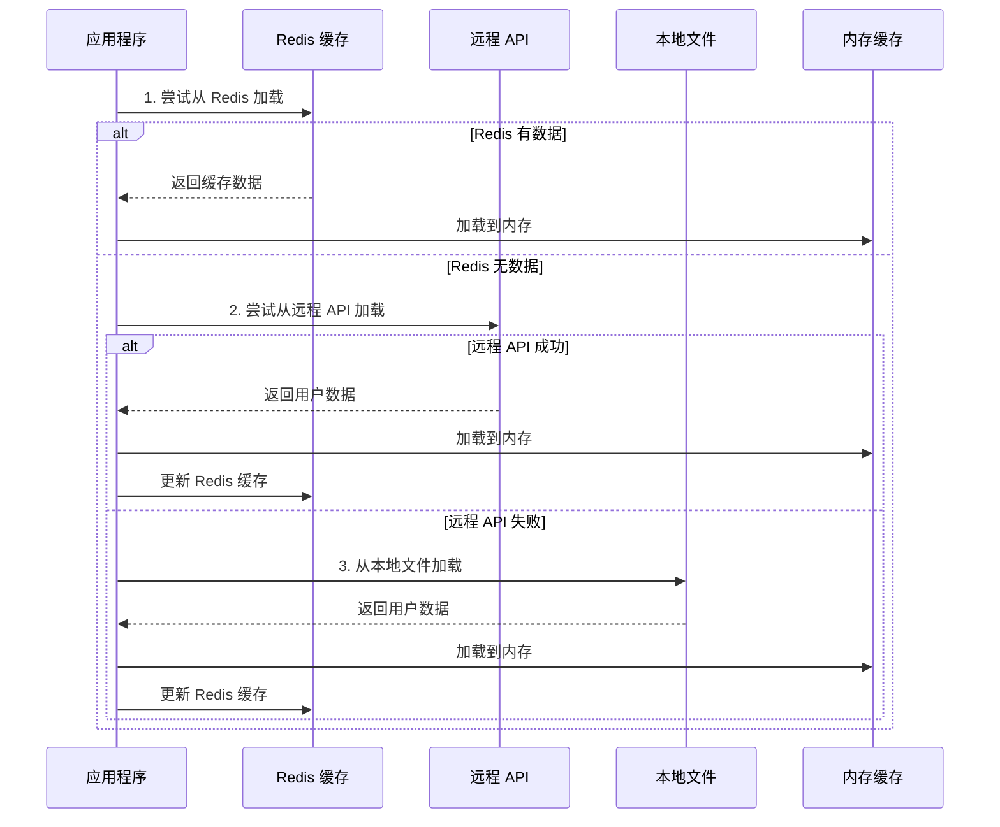
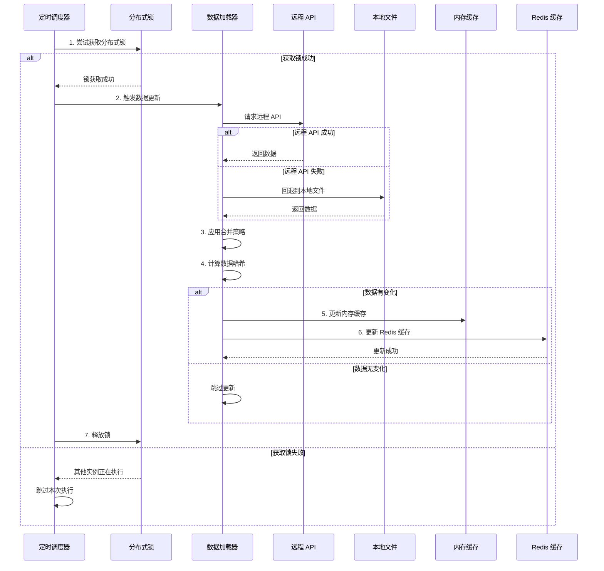
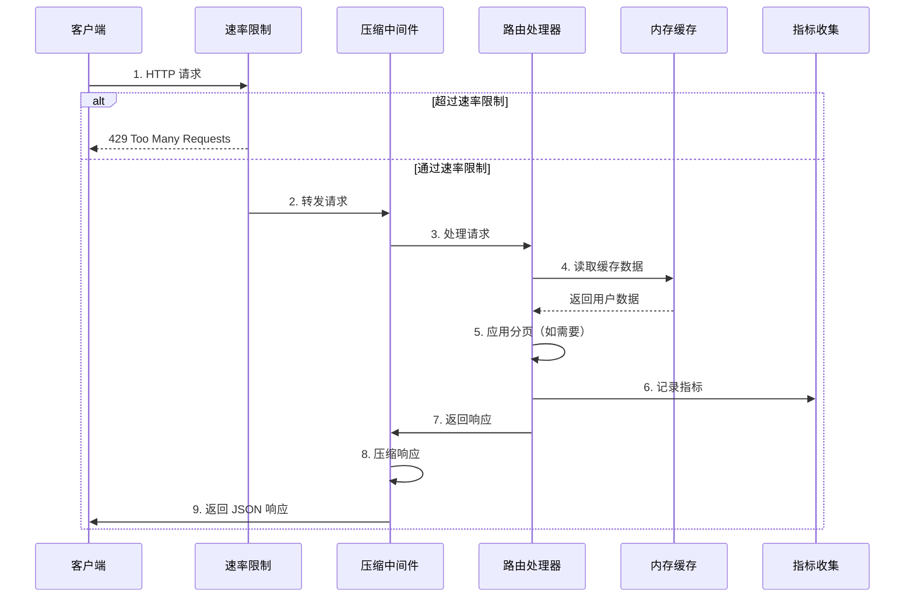
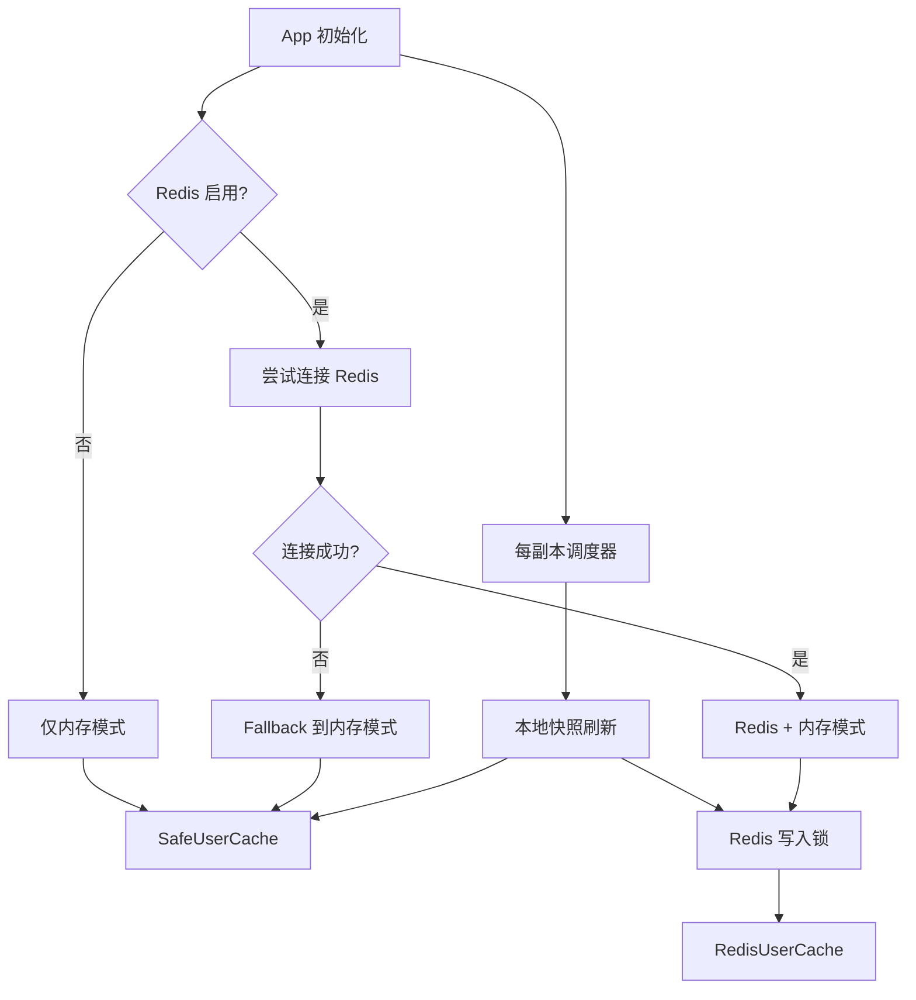
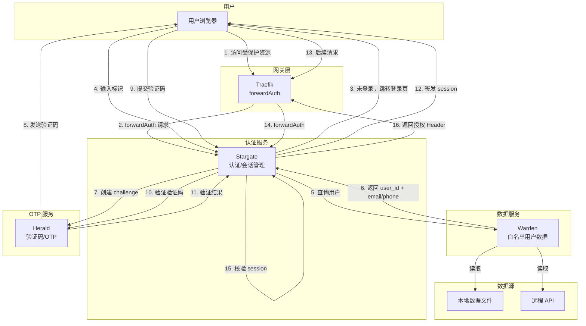
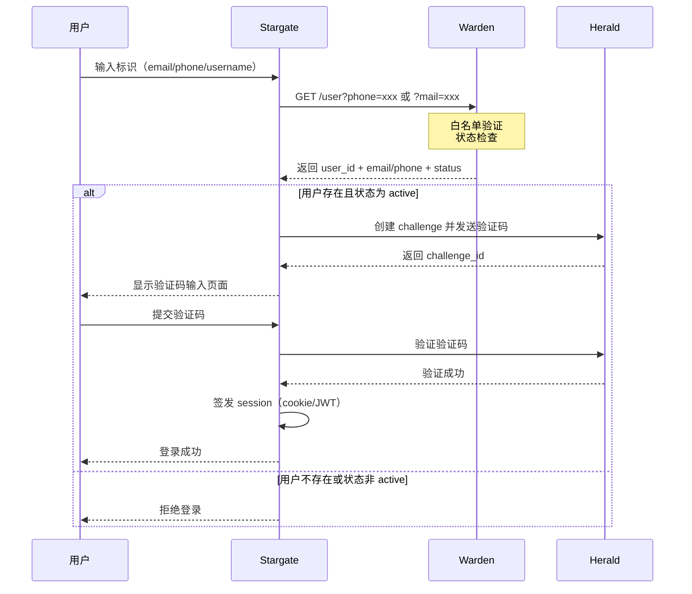

# 架构设计文档

> 🌐 **Language / 语言**: [English](../enUS/ARCHITECTURE.md) | [中文](ARCHITECTURE.md) | [Français](../frFR/ARCHITECTURE.md) | [Italiano](../itIT/ARCHITECTURE.md) | [日本語](../jaJP/ARCHITECTURE.md) | [Deutsch](../deDE/ARCHITECTURE.md) | [한국어](../koKR/ARCHITECTURE.md)

本文档详细说明 Warden 的系统架构、核心组件和数据流程。

Warden 是一个**独立**的允许列表用户数据服务，可以单独使用，也可以选择性地与其他服务集成。

## 系统架构图


```mermaid
graph TB
    subgraph "客户端层"
        Stargate[Stargate 认证服务]
        Client[HTTP 客户端]
    end

    subgraph "Warden 服务"
        subgraph "HTTP 层"
            Router[路由处理器]
            Middleware[中间件层]
            RateLimit[速率限制]
            Compress[压缩中间件]
            Metrics[指标收集]
        end

        subgraph "业务层"
            UserCache[内存缓存<br/>SafeUserCache]
            RedisCache[Redis 缓存<br/>RedisUserCache]
            Loader[数据加载器]
            Scheduler[定时调度器<br/>gocron]
        end

        subgraph "基础设施层"
            Logger[日志系统<br/>zerolog]
            Prometheus[Prometheus 指标]
            RedisLock[分布式锁<br/>Redis Lock]
        end
    end

    subgraph "数据源"
        LocalFile[本地数据文件<br/>data.json]
        RemoteAPI[远程数据 API]
    end

    subgraph "外部服务"
        Redis[(Redis 服务器)]
    end

    Stargate -->|查询用户信息| Router
    Client -->|HTTP 请求| Router
    Router --> Middleware
    Middleware --> RateLimit
    Middleware --> Compress
    Middleware --> Metrics
    Router --> UserCache
    UserCache -->|读取| RedisCache
    RedisCache --> Redis
    Scheduler -->|定时触发| Loader
    Loader -->|读取| LocalFile
    Loader -->|请求| RemoteAPI
    Loader -->|更新| UserCache
    Loader -->|更新| RedisCache
    Scheduler -->|获取锁| RedisLock
    RedisLock --> Redis
    Router --> Logger
    Metrics --> Prometheus
```

## 核心组件

1. **HTTP 服务器**: 提供 JSON API 接口返回用户列表
   - 支持分页查询
   - 压缩响应数据
   - 速率限制保护
   - 请求指标收集

2. **数据加载器**（parser-kit）: 支持从本地文件与远程 API 加载用户数据
   - 本地文件解析（JSON 格式）
   - 远程 API 调用（支持认证）
   - 多种数据合并策略

3. **定时调度器**: 使用 gocron 定期更新用户数据
   - 可配置的更新间隔
   - 基于 Redis 的分布式锁
   - 防止重复执行

4. **缓存系统**: 多级缓存架构
   - 内存缓存（SafeUserCache）：快速响应
   - Redis 缓存（RedisUserCache）：持久化存储
   - 智能缓存更新策略

5. **日志系统**: 基于 zerolog 的结构化日志记录
   - 结构化日志输出
   - 可动态调整日志级别
   - 访问日志和错误日志

6. **监控系统**: Prometheus 指标收集
   - HTTP 请求指标
   - 缓存命中率
   - 后台任务执行情况

## 数据流程

### 启动时数据加载流程


```mermaid
sequenceDiagram
    participant App as 应用程序
    participant Redis as Redis 缓存
    participant Remote as 远程 API
    participant Local as 本地文件
    participant Memory as 内存缓存

    App->>Redis: 1. 尝试从 Redis 加载
    alt Redis 有数据
        Redis-->>App: 返回缓存数据
        App->>Memory: 加载到内存
    else Redis 无数据
        App->>Remote: 2. 尝试从远程 API 加载
        alt 远程 API 成功
            Remote-->>App: 返回用户数据
            App->>Memory: 加载到内存
            App->>Redis: 更新 Redis 缓存
        else 远程 API 失败
            App->>Local: 3. 从本地文件加载
            Local-->>App: 返回用户数据
            App->>Memory: 加载到内存
            App->>Redis: 更新 Redis 缓存
        end
    end
```

### 定时任务更新流程


```mermaid
sequenceDiagram
    participant Scheduler as 定时调度器
    participant Lock as 分布式锁
    participant Loader as 数据加载器
    participant Remote as 远程 API
    participant Local as 本地文件
    participant Memory as 内存缓存
    participant Redis as Redis 缓存

    Scheduler->>Lock: 1. 尝试获取分布式锁
    alt 获取锁成功
        Lock-->>Scheduler: 锁获取成功
        Scheduler->>Loader: 2. 触发数据更新
        Loader->>Remote: 请求远程 API
        alt 远程 API 成功
            Remote-->>Loader: 返回数据
        else 远程 API 失败
            Loader->>Local: 回退到本地文件
            Local-->>Loader: 返回数据
        end
        Loader->>Loader: 3. 应用合并策略
        Loader->>Loader: 4. 计算数据哈希
        alt 数据有变化
            Loader->>Memory: 5. 更新内存缓存
            Loader->>Redis: 6. 更新 Redis 缓存
            Redis-->>Loader: 更新成功
        else 数据无变化
            Loader->>Loader: 跳过更新
        end
        Scheduler->>Lock: 7. 释放锁
    else 获取锁失败
        Lock-->>Scheduler: 其他实例正在执行
        Scheduler->>Scheduler: 跳过本次执行
    end
```

### 请求处理流程


```mermaid
sequenceDiagram
    participant Client as 客户端
    participant RateLimit as 速率限制
    participant Compress as 压缩中间件
    participant Router as 路由处理器
    participant Cache as 内存缓存
    participant Metrics as 指标收集

    Client->>RateLimit: 1. HTTP 请求
    alt 超过速率限制
        RateLimit-->>Client: 429 Too Many Requests
    else 通过速率限制
        RateLimit->>Compress: 2. 转发请求
        Compress->>Router: 3. 处理请求
        Router->>Cache: 4. 读取缓存数据
        Cache-->>Router: 返回用户数据
        Router->>Router: 5. 应用分页（如需要）
        Router->>Metrics: 6. 记录指标
        Router->>Compress: 7. 返回响应
        Compress->>Compress: 8. 压缩响应
        Compress->>Client: 9. 返回 JSON 响应
    end
```

## 数据合并策略

系统支持 7 种数据合并模式，通过 `MERGE_MODE` 选择（`MODE` 已弃用）：

| 模式 | 说明 | 使用场景 |
|------|------|----------|
| `DEFAULT` | 保留历史的远程优先、容错行为 | 向后兼容 |
| `REMOTE_FIRST` | 远程具有权威性；远程失败时保留最后一次成功快照并记录刷新失败 | 严格远程部署 |
| `ONLY_REMOTE` | 仅使用远程数据源 | 完全依赖远程配置 |
| `ONLY_LOCAL` | 仅使用本地配置文件 | 离线环境或测试环境 |
| `LOCAL_FIRST` | 本地优先，本地数据不存在时使用远程数据补充 | 本地配置为主，远程为辅 |
| `REMOTE_FIRST_ALLOW_REMOTE_FAILED` | 远程优先，允许远程失败时回退到本地 | 高可用场景 |
| `LOCAL_FIRST_ALLOW_REMOTE_FAILED` | 本地优先，允许远程失败时回退到本地 | 混合模式 |

详细说明请参考 [配置文档](CONFIGURATION.md)。

## Redis Fallback 和可选支持架构

### Redis 启用状态架构图


```mermaid
graph TB
    App[App 初始化] --> CheckRedis{Redis 启用?}
    App --> Scheduler[每副本调度器]
    CheckRedis -->|是| TryConnect[尝试连接 Redis]
    CheckRedis -->|否| MemoryOnly[仅内存模式]
    TryConnect --> ConnectSuccess{连接成功?}
    ConnectSuccess -->|是| RedisMode[Redis + 内存模式]
    ConnectSuccess -->|否| Fallback[Fallback 到内存模式]
    Scheduler --> LocalRefresh[本地快照刷新]
    LocalRefresh --> MemoryCache[SafeUserCache]
    RedisMode --> WriterLock[Redis 写入锁]
    LocalRefresh --> WriterLock
    WriterLock --> RedisCache[RedisUserCache]
    Fallback --> MemoryCache
    MemoryOnly --> MemoryCache
```

### 设计说明

#### 1. Redis 启用状态

应用支持三种 Redis 状态：

- **启用且可用** (`redis-enabled=true` 且连接成功)
  - 使用 Redis 缓存和分布式锁
  - 数据加载优先级：Redis 缓存 > 远程 API > 本地文件

- **启用但不可用** (`redis-enabled=true` 但连接失败)
  - 自动降级到内存模式（fallback）
  - 使用本地锁替代分布式锁
  - 数据加载优先级：远程 API > 本地文件

- **禁用** (`redis-enabled=false`)
  - 跳过 Redis 初始化
  - 使用内存缓存和本地锁
  - 数据加载优先级：远程 API > 本地文件

#### 2. 锁实现

- **Redis 分布式锁** (`cache.Locker`)
  - 为共享 Redis 缓存选举单一写入者
  - 基于 Redis SETNX，并支持自动过期
  - 不阻止每个副本独立加载数据和刷新进程内快照

- **本地锁** (`cache.LocalLocker`)
  - 适用于单机部署
  - 基于 `sync.Mutex` 实现
  - 进程退出时自动释放

#### 3. 数据加载策略

数据加载采用多级降级策略：

1. **Redis 缓存**（如果 Redis 可用）
2. **远程 API**（如果配置了远程地址）
3. **本地文件**（`data.json`）

#### 4. 健康检查状态

健康检查端点聚合 `redis`、`data`、`snapshot` 与
`snapshot_freshness`。非关键检查失败时返回 `degraded` 和 HTTP 200；关键
检查失败时返回 `unhealthy` 和 HTTP 503。

当 Redis 属于已配置的 HMAC v2 防重放契约时，它是关键依赖。
`REMOTE_FIRST` 与 `ONLY_REMOTE` 中的快照新鲜度也是关键检查：来源未知或
年龄超过 `SNAPSHOT_MAX_AGE` 时判定为不健康。容错模式可继续提供已验证的
本地或最后一次成功快照，并标记为 degraded。生产环境响应只暴露汇总的
`status` 与 `service`；开发和测试环境额外返回各项检查及低基数快照元数据。

### 配置参数

### 命令行参数

```bash
--redis-enabled=true|false  # 启用/禁用 Redis（默认: true，但在 ONLY_LOCAL 模式下默认为 false）
                            # 注意: 在 ONLY_LOCAL 模式下，如果显式设置了 --redis 地址，会自动启用 Redis
```

### 环境变量

```bash
REDIS_ENABLED=true|false|1|0  # 启用/禁用 Redis（默认: true，但在 ONLY_LOCAL 模式下默认为 false）
                              # 注意: 在 ONLY_LOCAL 模式下，如果显式设置了 REDIS 地址，会自动启用 Redis
```

### 优先级

命令行参数 > 环境变量 > 配置文件 > 默认值

### 使用示例

### 禁用 Redis

```bash
# 命令行
go run . --redis-enabled=false

# 环境变量
export REDIS_ENABLED=false
go run .
```

### 启用 Redis（默认）

```bash
go run . --redis localhost:6379
```

### Redis 连接失败时自动 fallback

```bash
# Redis 不可用，但应用仍能启动
go run . --redis invalid-host:6379
# 会记录警告，但继续使用内存缓存
```

### 注意事项

1. **性能影响**：内存模式下，多实例部署时数据不同步，适合单机部署
2. **数据持久化**：禁用 Redis 后，数据仅存在内存中，重启后丢失
3. **分布式锁**：本地锁仅适用于单机部署，多实例时无法防止重复执行
4. **日志记录**：Redis 不可用时应记录清晰的警告日志，便于运维排查

## 可选服务集成

Warden 可以**独立使用**，也可以选择性地与其他服务（如 Stargate 和 Herald）集成。以下集成方案是**可选的**，仅适用于需要构建完整认证架构的场景。

### Warden 职责边界

根据系统架构设计，Warden 的职责边界如下：

**必须做**：
- 白名单用户管理与查询
- 提供用户基本信息给 Stargate（email/phone/user_id/status）
- 可选：提供 scope/role/资源授权信息（用于 Stargate 输出到下游）

**禁止做**：
- ❌ 不发送验证码
- ❌ 不进行 OTP 校验

验证码和 OTP 相关功能由 Herald 服务负责，Warden 只负责用户数据查询和授权信息提供。

### Stargate + Warden + Herald 架构（可选）

如果需要构建完整的认证架构，Warden 可以与 Stargate 和 Herald 协同工作：


```mermaid
graph TB
    subgraph "用户"
        User[用户浏览器]
    end
    
    subgraph "网关层"
        Traefik[Traefik<br/>forwardAuth]
    end
    
    subgraph "认证服务"
        Stargate[Stargate<br/>认证/会话管理]
    end
    
    subgraph "数据服务"
        Warden[Warden<br/>白名单用户数据]
    end
    
    subgraph "OTP 服务"
        Herald[Herald<br/>验证码/OTP]
    end
    
    subgraph "数据源"
        LocalFile[本地数据文件]
        RemoteAPI[远程 API]
    end
    
    User -->|1. 访问受保护资源| Traefik
    Traefik -->|2. forwardAuth 请求| Stargate
    Stargate -->|3. 未登录，跳转登录页| User
    User -->|4. 输入标识| Stargate
    Stargate -->|5. 查询用户| Warden
    Warden -->|读取| LocalFile
    Warden -->|读取| RemoteAPI
    Warden -->|6. 返回 user_id + email/phone| Stargate
    Stargate -->|7. 创建 challenge| Herald
    Herald -->|8. 发送验证码| User
    User -->|9. 提交验证码| Stargate
    Stargate -->|10. 验证验证码| Herald
    Herald -->|11. 验证结果| Stargate
    Stargate -->|12. 签发 session| User
    User -->|13. 后续请求| Traefik
    Traefik -->|14. forwardAuth| Stargate
    Stargate -->|15. 校验 session| Stargate
    Stargate -->|16. 返回授权 Header| Traefik
```

### Stargate 调用 Warden 流程（可选集成场景）

在可选的集成场景中，登录流程中 Stargate 可以调用 Warden 查询用户信息：


```mermaid
sequenceDiagram
    participant User as 用户
    participant Stargate as Stargate
    participant Warden as Warden
    participant Herald as Herald
    
    User->>Stargate: 输入标识（email/phone/username）
    Stargate->>Warden: GET /user?phone=xxx 或 ?mail=xxx
    Note over Warden: 白名单验证<br/>状态检查
    Warden-->>Stargate: 返回 user_id + email/phone + status
    alt 用户存在且状态为 active
        Stargate->>Herald: 创建 challenge 并发送验证码
        Herald-->>Stargate: 返回 challenge_id
        Stargate-->>User: 显示验证码输入页面
        User->>Stargate: 提交验证码
        Stargate->>Herald: 验证验证码
        Herald-->>Stargate: 验证成功
        Stargate->>Stargate: 签发 session（cookie/JWT）
        Stargate-->>User: 登录成功
    else 用户不存在或状态非 active
        Stargate-->>User: 拒绝登录
    end
```

### 数据流向

1. **登录流程**（首次认证）：
   - Stargate → Warden：查询用户信息（白名单验证、状态检查）
   - Stargate → Herald：创建 challenge 并发送验证码
   - Stargate → Herald：验证验证码
   - Stargate：签发 session

2. **后续请求**（已登录）：
   - Traefik forwardAuth → Stargate：校验 session
   - Stargate：返回授权 Header（`X-Auth-User`、`X-Auth-Email`、`X-Auth-Scopes`、`X-Auth-Role`）
   - **不再调用 Warden/Herald**（除非需要刷新授权信息）

### 服务间鉴权（可选）

如果选择集成使用，Stargate 调用 Warden 时可以进行服务间鉴权，支持以下方式：

- **mTLS**（推荐）：使用双向 TLS 证书进行身份验证
- **HMAC 签名**：使用 HMAC-SHA256 签名验证请求

**注意**：如果 Warden 独立使用，服务间鉴权是可选的。详细配置请参考 [安全文档](SECURITY.md#服务间鉴权)。

## 相关文档

- [配置文档](CONFIGURATION.md) - 了解详细的配置选项
- [部署文档](DEPLOYMENT.md) - 了解部署架构
- [开发文档](DEVELOPMENT.md) - 了解开发相关架构
- [安全文档](SECURITY.md) - 了解服务间鉴权配置
