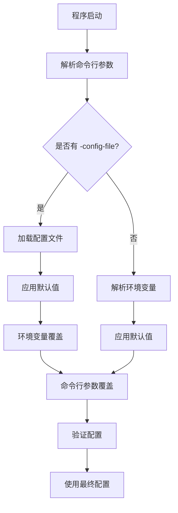

# 程序参数解析设计文档

## 概述

本文档详细说明了 warden 程序的参数解析机制，包括命令行参数、环境变量和配置文件的解析方式、优先级规则以及使用示例。

## 目录

- [架构设计](#架构设计)
- [优先级机制](#优先级机制)
- [支持的参数](#支持的参数)
- [使用方式](#使用方式)
- [最佳实践](#最佳实践)
- [常见问题](#常见问题)

---

## 架构设计

### 解析流程



### 核心组件

1. **`cmd.GetArgs()`** - 主入口函数，协调整个解析流程
2. **`config.LoadFromFile()`** - 配置文件加载器
3. **`overrideFromEnv()`** - 环境变量覆盖逻辑
4. **`overrideWithFlags()`** - 命令行参数覆盖逻辑

### 设计原则

- **向后兼容**：保持对旧版本参数格式的支持
- **灵活性**：支持多种配置方式（CLI、环境变量、配置文件）
- **安全性**：敏感信息（如密码）优先使用环境变量或文件
- **一致性**：所有配置源使用相同的验证规则

---

## 优先级机制

### 优先级顺序

```
命令行参数 > 环境变量 > 配置文件 > 默认值
```

### 详细说明

1. **命令行参数**（最高优先级）
   - 通过 `--flag` 或 `-flag` 传递
   - 会覆盖所有其他配置源的值
   - 适用于临时调试或覆盖特定配置

2. **环境变量**
   - 优先级高于配置文件
   - 适用于容器化部署和 CI/CD 环境
   - 敏感信息（如密码）推荐使用环境变量

3. **配置文件**
   - YAML 格式，支持结构化配置
   - 适用于复杂配置和版本控制
   - 通过 `--config-file` 参数指定

4. **默认值**
   - 当所有配置源都未提供时使用
   - 定义在 `internal/define/define.go` 中

### 特殊规则

#### Redis 密码优先级

Redis 密码有特殊的优先级规则：

```
环境变量 REDIS_PASSWORD > 密码文件 REDIS_PASSWORD_FILE > 命令行参数 --redis-password > 配置文件
```

#### 布尔标志处理

布尔标志（如 `--redis-enabled`、`--http-insecure-tls`）：
- 如果显式设置（通过 CLI 或环境变量），会覆盖配置文件中的值
- 环境变量支持：`true`/`false`/`1`/`0`（大小写不敏感）

---

## 支持的参数

### 服务器配置

#### PORT

- **CLI 参数**: `--port <端口号>`
- **环境变量**: `PORT`
- **配置文件**: `server.port`
- **类型**: 整数（1-65535）
- **默认值**: `8081`
- **说明**: HTTP 服务器监听端口

**示例**:
```bash
# CLI
./warden --port 9090

# 环境变量
export PORT=9090
./warden

# 配置文件
server:
  port: "9090"
```

---

### Redis 配置

#### REDIS

- **CLI 参数**: `--redis <host:port>`
- **环境变量**: `REDIS`
- **配置文件**: `redis.addr`
- **类型**: 字符串（格式：`host:port`）
- **默认值**: `localhost:6379`
- **说明**: Redis 服务器地址

**示例**:
```bash
# CLI
./warden --redis 192.168.1.100:6379

# 环境变量
export REDIS=192.168.1.100:6379
./warden
```

#### REDIS_PASSWORD

- **CLI 参数**: `--redis-password <密码>`
- **环境变量**: `REDIS_PASSWORD`
- **配置文件**: `redis.password`
- **类型**: 字符串
- **默认值**: 空字符串
- **说明**: Redis 密码（敏感信息，建议使用环境变量）
- **安全提示**: ⚠️ 不建议通过命令行参数传递密码

**示例**:
```bash
# 环境变量（推荐）
export REDIS_PASSWORD=your_password
./warden

# 密码文件（推荐，更安全）
export REDIS_PASSWORD_FILE=/path/to/password.txt
./warden
```

#### REDIS_PASSWORD_FILE

- **环境变量**: `REDIS_PASSWORD_FILE`
- **配置文件**: `redis.password_file`
- **类型**: 文件路径
- **默认值**: 空字符串
- **说明**: Redis 密码文件路径（文件内容会被读取作为密码）
- **优先级**: 低于 `REDIS_PASSWORD` 环境变量，高于配置文件

**示例**:
```bash
# 创建密码文件
echo "your_password" > /secure/path/redis_password.txt
chmod 600 /secure/path/redis_password.txt

# 使用密码文件
export REDIS_PASSWORD_FILE=/secure/path/redis_password.txt
./warden
```

#### REDIS_ENABLED

- **CLI 参数**: `--redis-enabled` / `--redis-enabled=false`
- **环境变量**: `REDIS_ENABLED`
- **类型**: 布尔值
- **默认值**: `true`
- **说明**: 是否启用 Redis（禁用后使用纯内存模式）
- **支持的值**: `true`/`false`/`1`/`0`（环境变量，大小写不敏感）

**示例**:
```bash
# CLI
./warden --redis-enabled=false

# 环境变量
export REDIS_ENABLED=false
./warden
```

---

### 远程配置

#### CONFIG

- **CLI 参数**: `--config <URL>`
- **环境变量**: `CONFIG`
- **配置文件**: `remote.url`
- **类型**: URL 字符串
- **默认值**: `http://localhost:8080/data.json`
- **说明**: 远程数据源 URL

**示例**:
```bash
# CLI
./warden --config https://api.example.com/users.json

# 环境变量
export CONFIG=https://api.example.com/users.json
./warden
```

#### KEY

- **CLI 参数**: `--key <密钥>`
- **环境变量**: `KEY`
- **配置文件**: `remote.key`
- **类型**: 字符串
- **默认值**: 空字符串
- **说明**: 远程配置的认证密钥（用于 Authorization 头）

**示例**:
```bash
# CLI
./warden --key Bearer your_token_here

# 环境变量
export KEY=Bearer your_token_here
./warden
```

---

### 应用模式

#### MODE

- **CLI 参数**: `--mode <模式>`
- **环境变量**: `MODE`
- **配置文件**: `remote.mode` 或 `app.mode`
- **类型**: 字符串
- **默认值**: `DEFAULT`
- **可选值**:
  - `DEFAULT` - 默认模式（远程优先，失败时降级到本地）
  - `REMOTE_FIRST` - 远程优先
  - `ONLY_REMOTE` - 仅远程
  - `ONLY_LOCAL` - 仅本地
  - `LOCAL_FIRST` - 本地优先
  - `REMOTE_FIRST_ALLOW_REMOTE_FAILED` - 远程优先，允许远程失败
  - `LOCAL_FIRST_ALLOW_REMOTE_FAILED` - 本地优先，允许远程失败

**示例**:
```bash
# CLI
./warden --mode ONLY_LOCAL

# 环境变量
export MODE=ONLY_LOCAL
./warden
```

---

### 任务配置

#### INTERVAL

- **CLI 参数**: `--interval <秒数>`
- **环境变量**: `INTERVAL`
- **配置文件**: `task.interval`
- **类型**: 整数（秒）
- **默认值**: `5`
- **说明**: 后台任务执行间隔（秒）

**示例**:
```bash
# CLI
./warden --interval 10

# 环境变量
export INTERVAL=10
./warden
```

---

### HTTP 客户端配置

#### HTTP_TIMEOUT

- **CLI 参数**: `--http-timeout <秒数>`
- **环境变量**: `HTTP_TIMEOUT`
- **配置文件**: `http.timeout`
- **类型**: 整数（秒）或 Duration 字符串
- **默认值**: `5`
- **说明**: HTTP 请求超时时间
- **格式支持**:
  - 整数秒数：`"30"` → 30 秒
  - Duration 格式：`"30s"` → 30 秒，`"1m30s"` → 90 秒

**示例**:
```bash
# CLI（秒数）
./warden --http-timeout 30

# 环境变量（支持两种格式）
export HTTP_TIMEOUT=30        # 整数秒数
export HTTP_TIMEOUT=30s      # Duration 格式
export HTTP_TIMEOUT=1m30s    # Duration 格式
./warden
```

#### HTTP_MAX_IDLE_CONNS

- **CLI 参数**: `--http-max-idle-conns <数量>`
- **环境变量**: `HTTP_MAX_IDLE_CONNS`
- **配置文件**: `http.max_idle_conns`
- **类型**: 整数
- **默认值**: `100`
- **说明**: HTTP 客户端最大空闲连接数

**示例**:
```bash
# CLI
./warden --http-max-idle-conns 200

# 环境变量
export HTTP_MAX_IDLE_CONNS=200
./warden
```

#### HTTP_INSECURE_TLS

- **CLI 参数**: `--http-insecure-tls` / `--http-insecure-tls=false`
- **环境变量**: `HTTP_INSECURE_TLS`
- **配置文件**: `http.insecure_tls`
- **类型**: 布尔值
- **默认值**: `false`
- **说明**: 是否跳过 TLS 证书验证（仅用于开发环境）
- **安全警告**: ⚠️ 生产环境不允许禁用 TLS 验证
- **支持的值**: `true`/`false`/`1`/`0`（环境变量，大小写不敏感）

**示例**:
```bash
# CLI
./warden --http-insecure-tls

# 环境变量
export HTTP_INSECURE_TLS=true
./warden
```

---

### 认证配置

#### API_KEY

- **CLI 参数**: `--api-key <密钥>`
- **环境变量**: `API_KEY`
- **配置文件**: `app.api_key`
- **类型**: 字符串
- **默认值**: 空字符串
- **说明**: API 认证密钥（用于保护 API 端点）
- **安全提示**: ⚠️ 强烈建议使用环境变量，不要写入配置文件

**示例**:
```bash
# CLI（不推荐用于生产环境）
./warden --api-key your_api_key_here

# 环境变量（推荐）
export API_KEY=your_api_key_here
./warden
```

---

### 配置文件

#### CONFIG_FILE

- **CLI 参数**: `--config-file <路径>`
- **类型**: 文件路径
- **默认值**: 空字符串（不使用配置文件）
- **说明**: 配置文件路径（支持 YAML 格式）

**示例**:
```bash
# 使用配置文件
./warden --config-file /path/to/config.yaml

# 配置文件示例见 config.example.yaml
```

---

### 其他环境变量

以下环境变量不通过 `cmd.GetArgs()` 解析，但在程序运行时会被使用：

#### LOG_LEVEL

- **环境变量**: `LOG_LEVEL`
- **类型**: 字符串
- **默认值**: `info`
- **可选值**: `trace`, `debug`, `info`, `warn`, `error`, `fatal`, `panic`
- **说明**: 日志输出级别

**示例**:
```bash
export LOG_LEVEL=debug
./warden
```

#### HEALTH_CHECK_IP_WHITELIST

- **环境变量**: `HEALTH_CHECK_IP_WHITELIST`
- **类型**: 字符串（逗号分隔的 IP 或 CIDR 网段）
- **默认值**: 空字符串（不限制）
- **说明**: 健康检查端点（`/health`, `/healthcheck`）的 IP 白名单

**示例**:
```bash
# 单个 IP
export HEALTH_CHECK_IP_WHITELIST=127.0.0.1
./warden

# 多个 IP 和 CIDR 网段
export HEALTH_CHECK_IP_WHITELIST=127.0.0.1,::1,10.0.0.0/8
./warden
```

#### IP_WHITELIST

- **环境变量**: `IP_WHITELIST`
- **类型**: 字符串（逗号分隔的 IP 或 CIDR 网段）
- **默认值**: 空字符串（不限制）
- **说明**: 全局 IP 白名单（限制所有端点的访问）

**示例**:
```bash
export IP_WHITELIST=192.168.1.0/24,10.0.0.0/8
./warden
```

#### TRUSTED_PROXY_IPS

- **环境变量**: `TRUSTED_PROXY_IPS`
- **类型**: 字符串（逗号分隔的 IP 地址）
- **默认值**: 空字符串
- **说明**: 信任的反向代理 IP 列表，用于正确获取客户端真实 IP（从 `X-Forwarded-For` 等头部）

**示例**:
```bash
export TRUSTED_PROXY_IPS=127.0.0.1,10.0.0.1,172.16.0.1
./warden
```

---

## 使用方式

### 方式一：仅使用命令行参数

适用于快速启动和测试：

```bash
./warden \
  --port 8081 \
  --redis localhost:6379 \
  --config https://api.example.com/data.json \
  --key Bearer token123 \
  --mode DEFAULT \
  --interval 5
```

### 方式二：使用环境变量

适用于容器化部署和 CI/CD：

```bash
export PORT=8081
export REDIS=localhost:6379
export REDIS_PASSWORD=your_password
export CONFIG=https://api.example.com/data.json
export KEY=Bearer token123
export MODE=DEFAULT
export INTERVAL=5
export API_KEY=your_api_key

./warden
```

### 方式三：使用配置文件

适用于复杂配置和版本控制：

```bash
# 创建配置文件
cat > config.yaml <<EOF
server:
  port: "8081"

redis:
  addr: "localhost:6379"
  # 密码通过环境变量设置

remote:
  url: "https://api.example.com/data.json"
  key: "Bearer token123"
  mode: "DEFAULT"

task:
  interval: 5s

app:
  mode: "DEFAULT"
  # API Key 通过环境变量设置
EOF

# 启动程序
./warden --config-file config.yaml
```

### 方式四：混合使用（推荐）

结合配置文件和环境变量，命令行参数用于临时覆盖：

```bash
# 基础配置在文件中
./warden --config-file config.yaml

# 临时覆盖端口
./warden --config-file config.yaml --port 9090

# 使用环境变量覆盖敏感信息
export REDIS_PASSWORD=your_password
export API_KEY=your_api_key
./warden --config-file config.yaml
```

---

## 最佳实践

### 1. 敏感信息管理

✅ **推荐做法**:
- 使用环境变量存储密码和密钥
- 使用密码文件（`REDIS_PASSWORD_FILE`）存储 Redis 密码
- 在配置文件中使用占位符或注释说明

❌ **不推荐做法**:
- 在配置文件中硬编码密码
- 通过命令行参数传递密码（会出现在进程列表中）
- 将包含敏感信息的配置文件提交到版本控制

**示例**:
```yaml
# config.yaml
redis:
  addr: "localhost:6379"
  # password: ""  # 使用环境变量 REDIS_PASSWORD 或 REDIS_PASSWORD_FILE

app:
  # api_key: ""  # 使用环境变量 API_KEY
```

### 2. 配置文件组织

✅ **推荐做法**:
- 为不同环境创建不同的配置文件（`config.dev.yaml`, `config.prod.yaml`）
- 使用版本控制管理配置文件模板
- 在配置文件中添加注释说明

❌ **不推荐做法**:
- 在配置文件中包含敏感信息
- 使用绝对路径（不利于跨环境部署）

### 3. 容器化部署

在 Docker/Kubernetes 环境中：

```yaml
# docker-compose.yml
services:
  warden:
    image: warden:latest
    environment:
      - PORT=8081
      - REDIS=redis:6379
      - REDIS_PASSWORD_FILE=/run/secrets/redis_password
      - CONFIG=https://api.example.com/data.json
      - KEY=Bearer ${API_TOKEN}
      - MODE=DEFAULT
      - API_KEY=${WARDEN_API_KEY}
    secrets:
      - redis_password
```

### 4. 开发环境配置

开发环境可以使用更宽松的配置：

```bash
# .env (开发环境)
PORT=8081
REDIS=localhost:6379
CONFIG=http://localhost:8080/data.json
MODE=ONLY_LOCAL
HTTP_INSECURE_TLS=true  # 仅开发环境
```

### 5. 生产环境配置

生产环境应该：

- ✅ 使用环境变量管理所有敏感信息
- ✅ 禁用 `HTTP_INSECURE_TLS`
- ✅ 使用强密码和 API 密钥
- ✅ 启用 Redis（如果可用）
- ✅ 使用合适的运行模式（如 `REMOTE_FIRST`）

```bash
# 生产环境启动脚本
#!/bin/bash
export PORT=${PORT:-8081}
export REDIS=${REDIS:-redis:6379}
export REDIS_PASSWORD_FILE=/run/secrets/redis_password
export CONFIG=${CONFIG:-https://api.example.com/data.json}
export KEY=${KEY:-Bearer ${API_TOKEN}}
export MODE=${MODE:-REMOTE_FIRST}
export API_KEY=${WARDEN_API_KEY}
export HTTP_INSECURE_TLS=false  # 生产环境必须为 false

./warden --config-file /etc/warden/config.yaml
```

---

## 常见问题

### Q1: 为什么命令行参数会覆盖环境变量？

**A**: 这是设计决策，命令行参数具有最高优先级，允许用户在运行时临时覆盖配置，便于调试和测试。

### Q2: 如何查看当前使用的配置？

**A**: 程序启动时会输出配置信息到日志。你也可以通过健康检查端点 `/health` 查看部分配置信息（不包含敏感信息）。

### Q3: HTTP_TIMEOUT 支持哪些格式？

**A**: 支持两种格式：
- 整数秒数：`"30"` → 30 秒
- Duration 格式：`"30s"`, `"1m30s"`, `"2h"` 等

### Q4: Redis 密码的优先级是什么？

**A**: 优先级顺序：
1. 环境变量 `REDIS_PASSWORD`
2. 密码文件 `REDIS_PASSWORD_FILE`
3. 命令行参数 `--redis-password`
4. 配置文件 `redis.password`

### Q5: 如何禁用 Redis？

**A**: 可以通过以下方式禁用：
```bash
# CLI
./warden --redis-enabled=false

# 环境变量
export REDIS_ENABLED=false
./warden
```

**注意**: 在 `ONLY_LOCAL` 模式下，Redis 默认禁用，无需额外配置。如果需要启用 Redis，可以通过以下方式：

1. **显式设置 Redis 地址**（推荐，会自动启用 Redis）：
```bash
# 设置 REDIS 地址会自动启用 Redis
MODE=ONLY_LOCAL REDIS=localhost:6379 ./warden
# 或使用命令行参数
./warden --mode ONLY_LOCAL --redis localhost:6379
```

2. **显式设置 REDIS_ENABLED**：
```bash
# 显式启用 Redis
MODE=ONLY_LOCAL REDIS_ENABLED=true ./warden
```

### Q6: 配置文件加载失败会怎样？

**A**: 如果指定的配置文件加载失败，程序会：
- 如果提供了 `--config-file` 参数但文件加载失败，会回退到使用命令行参数和环境变量
- 如果配置文件格式错误，会返回错误并退出

### Q7: 环境变量名称是否区分大小写？

**A**: 在 Unix/Linux 系统中，环境变量名称是区分大小写的。请确保使用正确的大小写（如 `REDIS_PASSWORD` 而不是 `redis_password`）。

### Q8: 如何验证配置是否正确？

**A**: 程序启动时会进行配置验证，如果配置无效会输出错误信息并退出。你也可以使用 `cmd.ValidateConfig()` 函数在代码中验证配置。

---

## 相关文档

- [架构设计文档](./ARCHITECTURE.md) - 了解整体架构
- [配置文件示例](../config.example.yaml) - 查看配置文件格式
- [代码实现](../internal/cmd/cmd.go) - 查看参数解析实现
- [环境变量检查报告](../ENV_CLI_CHECK_REPORT.md) - 了解解析机制验证
